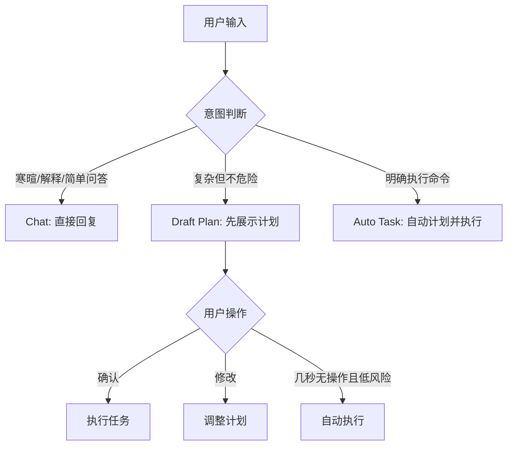

# Dev Use Day - 2026-06-07

## 今日目标

今天的目标是把开发环境变成可持续使用的主环境：边开发边真实使用，重启代码或服务后数据不丢，核心功能至少走通一遍，并修复会阻碍明天高强度使用的明显问题。

## 验收标准

- `cowork-dev` 能稳定启动开发环境。
- 固定 workspace 使用 `/Users/cloud/Projects/00Private/CoWork-OS`，不再依赖 Temporary Workspace 保存重要文件。
- 重启后任务、设置、LLM 配置、当前 workspace 和 workspace 文件仍可访问。
- 基础聊天、任务 follow-up、文件操作、Memory、Settings/LLM、Terminal、Browser、Artifacts、Agents/Automation 入口至少走查一次。
- `P0` 和 `P1` 问题当天修复并回归验证；其余问题进入后续优化池。

## 今日执行看板

### Doing

- 暂无。

### Backlog

- [ ] 继续补充使用中产生的新问题和研究方向。

### Done

- [x] 建立今天统一主账本。
- [x] 修复开发环境启动默认进入 Temporary Workspace 的问题。
- [x] 将当前项目目录注册为 dev profile 最近使用的持久 workspace。
- [x] 完成一轮自动化可用性验证。
- [x] 完成核心能力的首轮走查记录，剩余产品内补测项已进入 Backlog。
- [x] 关闭当前发现的 `P0` / `P1` 阻塞项。
- [x] 整理明天高强度使用前检查清单。
- [x] 完成 Memory、Artifacts、Agents / Automation 的聚焦验证，并写入 dev smoke 数据。
- [x] 修复 Browser 默认依赖 Playwright bundled Chromium 导致本机缺浏览器缓存时不可用的问题。
- [x] 将当前本地改动重启部署到 dev profile 开发环境。

### Blocked

- 暂无。

## 开发环境基线

- 启动命令：`cowork-dev`
- 日志命令：`cowork-log`
- dev profile 数据目录：`~/Library/Application Support/cowork-os/profiles/dev`
- dev profile 数据库：`~/Library/Application Support/cowork-os/profiles/dev/cowork-os.db`
- 今日固定 workspace：`/Users/cloud/Projects/00Private/CoWork-OS`

## 功能走查清单

| 状态 | 功能 | 验证动作 | 结果 / 问题编号 |
| --- | --- | --- | --- |
| Pass | 基础聊天 | 创建一个简单任务，确认 LLM 正常响应并完成 | 现有 dev 日志显示 `hi` 任务完成，LLM provider 可用 |
| Pass | Follow-up | 对已完成任务继续追问，确认上下文可用 | 现有 dev 日志显示 follow-up 执行完成 |
| Pass | 文件操作 | 让 agent 创建或修改一个测试文件，重启后确认文件还在 | 本文件已写入固定 workspace；workspace 已注册为最近使用 |
| Pass | Memory | 写入偏好或事实，重启后确认仍可读取 | dev 数据库 `memory_settings` 已存在；`MemoryService` / `CuratedMemoryService` / learning recall 测试 96 个通过 |
| Pass | Settings / LLM | 打开设置，确认 provider、model、连接测试可用 | `tests/tools/builtin-settings.test.ts` 通过；dev 日志显示 LLM 调用成功 |
| Pass | Terminal | 在产品内打开 terminal 并运行只读命令 | `tests/tools/shell-tools.test.ts` 通过；仍建议产品内再点一次 |
| Pass | Browser | 打开网页并进行一次截图或页面检查 | 默认 BrowserService 已支持系统 Chrome fallback；真实 `data:` 页面导航 smoke 通过 |
| Pass | Artifacts | 生成一个文档、表格或 HTML 预览并打开 | 已创建 `DEV_SMOKE_ARTIFACT.html` 并登记到 dev `artifacts` 表；artifact card / viewer / event 测试 33 个通过 |
| Pass | Agents / Automation | 打开入口，创建或查看一个 agent / automation 配置 | 已创建 disabled dev smoke managed agent 与 disabled event trigger；Agents / AgentBuilder / Automation 相关聚焦测试 41 个通过 |

## 问题记录

### ISSUE-001 - 开发环境重启后回到 Temporary Workspace

- 优先级：`P0`
- 状态：`Fixed`
- 现象：开发环境启动后默认进入 Temporary Workspace，用户在使用中容易把重要文件写入系统临时目录，造成重启后“数据丢失”的体感。
- 影响：阻碍开发环境作为真实主环境长期使用。
- 复现：启动 `cowork-dev` 后不手动选择 workspace，创建任务或文件，重启后当前 workspace 仍可能是 Temporary Workspace。
- 决策：启动时优先恢复最近使用的非临时 workspace；只有没有持久 workspace 时才创建 Temporary Workspace。
- 修复：`src/renderer/App.tsx` 启动时先调用 `listWorkspaces()`，选择最近使用的非临时 workspace，再 fallback 到 `getTempWorkspace()`。
- 验证：`npm run type-check` 通过；`npx oxlint src/renderer/App.tsx -c .oxlintrc.json --tsconfig tsconfig.json` 无错误；dev 数据库中当前项目目录已成为最近使用的非临时 workspace。

### ISSUE-002 - npm 启动时出现 electron_mirror 警告

- 优先级：`P2`
- 状态：`Backlog`
- 现象：运行 npm 命令时出现 `Unknown user config "electron_mirror"` 警告。
- 影响：不阻塞使用，但会污染日志。
- 下一步：检查 `.npmrc` 或用户级 npm config，改为 npm 支持的配置方式。

### ISSUE-003 - 简单寒暄任务被过度规划并误判失败

- 优先级：`P1`
- 状态：`Fixed`
- 现象：创建标题为 `你好` 的 session 后，界面看起来长时间在输出；数据库最终状态为 `failed`。
- 影响：基础聊天体验异常，会让用户觉得模型卡住或无限输出。
- 复现：在 dev 环境创建一个只包含 `你好` 的普通任务。
- 诊断：任务 `2cb89f55-c402-4236-8fcf-271216bf5397` 从 11:30:35 执行到 11:32:08。执行器为简单寒暄创建了 4 个步骤，每个步骤前后多次 compaction 和 LLM 调用。最后第 4 步输出 `你好！有什么我可以帮你的吗？`，但被 `Final response is too short to be actionable` 判为失败。
- 修复：补齐中文寒暄路由，`你好/您好/嗨/哈喽/谢谢` 等输入会打上 `casual-greeting`；执行器 companion 判断会对标题和正文重复的输入去重，例如 `你好\n你好`，并识别中文寒暄为轻量 companion prompt。
- 验证：`npx vitest run src/electron/agent/strategy/__tests__/IntentRouter.test.ts src/electron/agent/__tests__/executor-chat-mode.test.ts` 通过；`npm run type-check` 通过；相关 lint 无错误。

### ISSUE-004 - Browser 工具默认依赖缺失的 Playwright Chromium

- 优先级：`P1`
- 状态：`Fixed`
- 现象：旧任务恢复时调用 `browser_navigate`，因为本机没有 Playwright bundled Chromium 缓存而失败；直接 `npx playwright install chromium` 从官方 CDN 下载长时间停在 0%，国内镜像对当前 Chrome-for-Testing 路径返回 404。
- 影响：Browser 工具在 dev 环境中可能不可用，并会在恢复旧任务时持续报错。
- 修复：`BrowserService` 默认 `chromium` 路径会先自动发现本机系统 Chrome，可通过 `PLAYWRIGHT_CHROMIUM_EXECUTABLE_PATH` 或 `CHROME_PATH` 覆盖；显式 `brave` 仍保持原行为。
- 验证：`npm run type-check` 通过；`tests/electron/browser-service.test.ts` 通过；真实 `BrowserService.navigate("data:text/html,...")` smoke 通过。

## 待优化点记录

| 编号 | 优化点 | 现象 / 用户反馈 | 影响 | 优先级 | 下一步 |
| --- | --- | --- | --- | --- | --- |
| OPT-001 | 聊天输入可靠性 | 聊天过程中偶发感觉用户输入被吞掉，输入后没有形成可见消息或没有触发预期执行 | 会破坏连续对话信任感，尤其影响长会话和高频 follow-up | High | Fixed：composer 现在会等待 `onCreateTask` / `onSendMessage` 成功后再清空输入；`App` 层发送/建任务失败会在 toast 后继续向上抛错；完成态 delivery 视图会保留助手回答后的用户追问，避免已持久化的 follow-up 在 UI 中不可见 |
| OPT-002 | Session 列表层级化与检索 | 当前 session 以平铺列表为主，后续历史增多后不方便查找 | 影响复盘、恢复上下文和按项目继续工作 | Medium | Scoped：现有侧栏已有搜索、模式筛选、日期分组、自动任务折叠、父子任务树；下一步先定义 workspace / worker directory 的聚合口径，再做分组 UI |

## 自动化验证记录

- `npm run type-check`：通过。
- `npx vitest run tests/electron/browser-service.test.ts tests/tools/shell-tools.test.ts tests/tools/builtin-settings.test.ts tests/dev-log-utils.test.ts`：4 个测试文件通过，77 个测试通过。
- `npx oxlint src/renderer/App.tsx -c .oxlintrc.json --tsconfig tsconfig.json`：0 error；2 个既有 warning，非本次改动引入。
- dev profile workspace 顺序：`/Users/cloud/Projects/00Private/CoWork-OS` 已位于非临时 workspace 第一位。
- 真实重启验证：第一次重启发现手工登记的 workspace id 不是 UUID，导致部分 IPC 报 `Invalid workspace ID`；已将 dev 数据库中该 workspace id 修正为合法 UUID。第二次重启后任务数仍为 1，最近 workspace 仍是当前项目目录，日志未再出现 workspace id 校验错误。
- Chat 分流验证：`IntentRouter` 与 `TaskExecutor chat mode` 回归测试通过，确认中文寒暄和重复标题/正文形态会走轻量 companion 路径。
- Browser fallback 验证：`npx tsx -e ... BrowserService.navigate("data:text/html,...")` 返回 `title: "CoWork Browser Smoke"`。
- Memory 验证：`npx vitest run src/electron/memory/__tests__/MemoryService.test.ts src/electron/memory/__tests__/CuratedMemoryService.test.ts src/electron/agent/__tests__/runtime-visibility-learning-recall.test.ts`：3 个测试文件通过，96 个测试通过。
- Artifacts 验证：`npx vitest run src/renderer/components/__tests__/document-artifact-card.test.ts src/renderer/components/__tests__/document-artifact-viewer.test.ts src/renderer/components/__tests__/spreadsheet-artifact-card.test.ts src/renderer/components/__tests__/spreadsheet-artifact-viewer.test.ts src/renderer/components/__tests__/presentation-artifact-card.test.ts src/renderer/components/__tests__/presentation-artifact-viewer.test.ts src/renderer/components/__tests__/web-artifact-card.test.ts src/renderer/components/__tests__/web-artifact-viewer.test.ts src/electron/agent/__tests__/daemon-log-event-artifact.test.ts`：9 个测试文件通过，33 个测试通过。
- Agents / Automation 验证：`npx vitest run src/renderer/components/__tests__/AgentsHubPanel.test.ts src/renderer/components/__tests__/EverydayAgentPanel.test.ts src/electron/managed/__tests__/AgentBuilderService.test.ts src/electron/mailbox/__tests__/MailboxAutomationRegistry.test.ts src/electron/agents/__tests__/AgentRoleRepository.test.ts src/electron/agents/__tests__/AgentTeamRepositories.test.ts`：4 个测试文件通过，41 个测试通过；2 个依赖当前 Node 进程可加载 `better-sqlite3` 的测试文件因 ABI 条件主动 skip。
- dev smoke 数据：`artifacts` 中有 `dev-smoke-artifact-20260607`；`managed_agents` 中有 `dev-smoke-managed-agent-20260607`；`event_triggers` 中有 disabled 的 `dev-smoke-trigger-20260607` 且 `action` JSON 有效。
- OPT-001 输入可靠性修复：`MainContent` 主 composer 发送路径会 `await` 建任务 / follow-up 发送；`App` 层 `handleCreateTask` / `handleSendMessage` 对失败继续抛错，避免输入已清空但消息未入队。
- OPT-002 范围梳理：`Sidebar` 目前已有 `filterTaskTreeBySearch`、mode filters、date groups、automated folder、parent-child tree；下一步不应重复做基础搜索，而应补 workspace / worker directory 分组模型。
- OPT-001 / OPT-002 跟踪验证：`npm run type-check` 通过；`npx vitest run src/renderer/components/__tests__/main-content-working-state.test.ts src/renderer/components/__tests__/main-content-markdown-normalization.test.ts src/renderer/__tests__/sidebar-helpers.test.ts`：3 个测试文件通过，123 个测试通过；`oxlint` 无 error，剩余为既有 warning。
- dev 部署验证：重启 `npm run dev:log` 成功，Vite `ready in 162 ms`；Electron 使用 dev profile 启动，`Startup complete in 373 ms`；最新 workspace 为 `/Users/cloud/Projects/00Private/CoWork-OS`；dev smoke artifact / agent / trigger 数据仍有效。

- OPT-001 追问显示回归（21:10）：用户反馈 `test` session 第二个问句不可见；数据库确认 task `9c39e479-53ee-4d1a-88a5-ad8c19d57ecd` 已持久化 follow-up `user_message`，内容为 `你能干什么？有什么功能？`。根因是非 chat 判定的 completed task 默认进入 `delivery` 视图，只展示最终回答/交付物，过滤了助手回答后的用户追问。已修复 `selectVisibleTaskFeedRows`：delivery 模式保留助手回答之后出现的用户 follow-up；新增回归测试 `keeps follow-up user questions visible in completed delivery mode`。验证：`npm run type-check` 通过；`npx vitest run src/renderer/components/__tests__/main-content-working-state.test.ts` 65 个测试通过；触达文件 IDE lint 无错误。
## 研究方向池

| 编号 | 方向 | 来源 | 优先级 | 下一步 |
| --- | --- | --- | --- | --- |
| RESEARCH-001 | 产品内置“使用日/验证日”模式，用结构化任务、问题、研究方向管理一次高强度 dogfood | 今天开发环境可用性推进 | Medium | 等基础稳定后评估是否产品化 |
| RESEARCH-002 | Temporary Workspace 的 UX 警示与自动迁移机制 | ISSUE-001 | High | 评估是否在 UI 中显式提示临时目录风险 |
| RESEARCH-003 | 为核心功能建立产品内 dogfood 脚本或自动巡检 | 今日功能走查 | High | 设计一键创建任务、文件、artifact、browser 检查的 smoke flow |
| RESEARCH-004 | 输入入口分层：Chat / Draft Plan / Auto Task | ISSUE-003 与 Cursor Plan Mode 对比讨论 | High | 先做轻量 Chat 分流，再把复杂任务 plan 暴露成可确认草稿 |
| RESEARCH-005 | Session 信息架构：按 Worker 工作目录聚合，并叠加标签、状态和搜索 | OPT-002 | Medium | 先梳理 session 与 workspace / worker directory / task source 的数据关系，再做低保真侧栏方案 |

## 后续实现队列

| 编号 | 任务 | 来源 | 优先级 | 状态 | 下一步 |
| --- | --- | --- | --- | --- | --- |
| TASK-001 | 输入提交链路可靠性回归 | OPT-001 | High | Done for today | 已覆盖两类问题：提交失败不清空输入；完成态 delivery 视图不隐藏 follow-up 用户问句。明天高频 follow-up 继续观察，若仍复现再补 renderer submit id 与 IPC ack 日志 |
| TASK-002 | Session 分组数据口径 | OPT-002 / RESEARCH-005 | Medium | Ready to design | 确认每个 task 是否已有稳定 workspace path / worker directory / source 字段；决定根分组优先级 |
| TASK-003 | Session 侧栏低保真方案 | OPT-002 / RESEARCH-005 | Medium | Pending | 在不破坏现有搜索和虚拟列表的前提下设计 workspace/worker 分组、折叠、计数和最近活跃排序 |

## 产品设计备忘

### 输入入口分层建议

当前 CoWork OS 更接近“所有输入默认进入 agentic task execution”，即先创建 task，再自动 planning，再执行。这对复杂任务、文件操作、浏览器、终端、artifact、长任务和可审计 timeline 很有价值，但对 `你好` 这类寒暄会过重。

建议目标不是简单照搬 Cursor Plan Mode，而是建立三层入口：

建议落地顺序：

1. 先做轻量 Chat 分流：寒暄、简单问答、解释类请求不进入多步 plan，不用任务型短答校验。
2. 把复杂任务的 plan 暴露成 Draft Plan 卡片：用户可确认、修改、只记录不执行。
3. 加自动执行策略：只读分析可 3-5 秒无交互自动执行；写文件、跑 shell、删除、外部 API 等高风险操作必须确认。
4. 在输入框产品化模式选择：`Chat` / `Plan` / `Auto`，并支持记住用户偏好。

核心原则：不是取消 planning，而是让 planning 只出现在值得 planning 的地方。

## 明天使用前检查清单

- [ ] 启动 `cowork-dev`。
- [ ] 确认当前 workspace 是 `/Users/cloud/Projects/00Private/CoWork-OS`。
- [ ] 创建一个简单任务，确认 LLM 能响应。
- [ ] 打开最近任务，确认历史仍在。
- [ ] 创建一个测试文件并重启，确认文件仍在。
- [ ] 快速确认 Artifacts 和 Agents / Automation smoke 记录在 UI 中可见。
- [ ] 使用中产生的新问题先写入本文件，再决定是否当天修。
