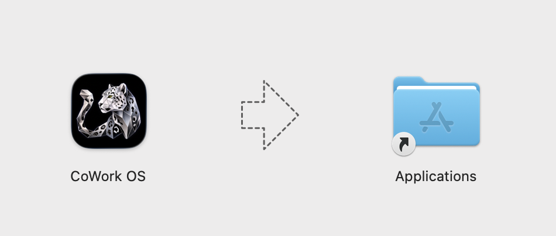
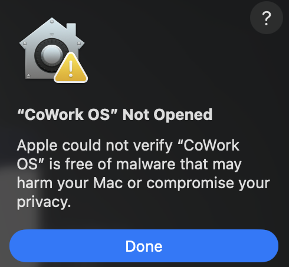
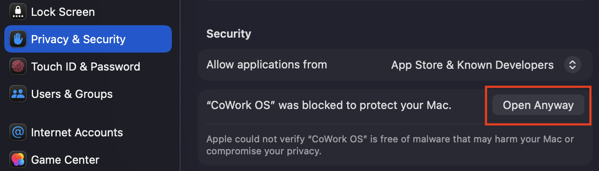
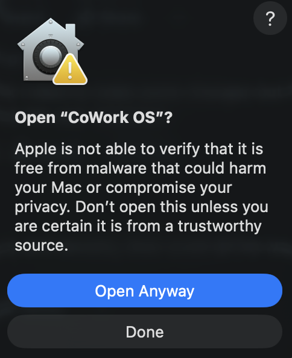
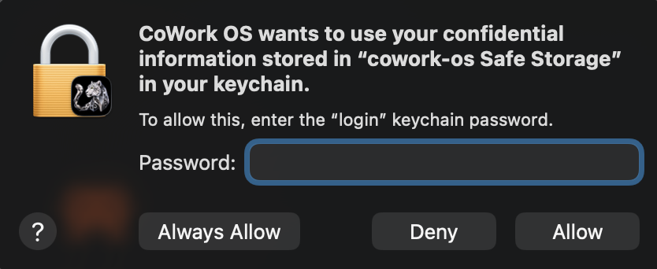

<p align="center">
  <picture>
    <source media="(prefers-color-scheme: dark)" srcset="screenshots/cowork-os-sl-dark-logo.png">
    <source media="(prefers-color-scheme: light)" srcset="screenshots/cowork-os-sl-color-logo.png">
    
  </picture>
</p>

<p align="center">
  <strong>CoWork OS is the GUI-first, CLI-capable local AI super app and everything app for getting real work done.</strong><br>
  Code, email, research, design web pages, create documents, work with spreadsheets and decks, spawn and manage agents, run automations, and ask for changes from the desktop app or the <code>cowork</code> CLI without jumping between separate coding, mail, browser, Word, Excel, or PowerPoint apps.
</p>

<p align="center">
  <a href="https://www.npmjs.com/package/cowork-os"></a>
  <a href="https://github.com/CoWork-OS/CoWork-OS/actions/workflows/ci.yml"></a>
  <a href="https://opensource.org/licenses/MIT"></a>
  <a href="https://www.apple.com/macos/"></a>
  <a href="https://www.microsoft.com/windows"></a>
</p>

<p align="center">
  <a href="docs/getting-started.md">Getting Started</a> &middot;
  <a href="docs/composer-mentions.md">Composer Mentions</a> &middot;
  <a href="docs/message-box-shortcuts.md">Message Box Shortcuts</a> &middot;
  <a href="docs/side-chat.md">Side Chat</a> &middot;
  <a href="docs/ask-inbox-architecture.md">Ask Inbox</a> &middot;
  <a href="docs/everything-workbench.md">Everything Workbench</a> &middot;
  <a href="docs/cli.md">CoWork CLI</a> &middot;
  <a href="docs/terminal-tabs.md">Terminal Tabs</a> &middot;
  <a href="docs/browser-workbench.md">Browser Workbench</a> &middot;
  <a href="docs/showcase.md">Use Cases</a> &middot;
  <a href="docs/release-notes-0.5.49.md">Release Notes 0.5.49</a> &middot;
  <a href="docs/integration-skill-bootstrap-lifecycle.md">Platform Updates</a> &middot;
  <a href="docs/">Documentation</a> &middot;
  <a href="CHANGELOG.md">Changelog</a> &middot;
  <a href="SECURITY.md">Security</a> &middot;
  <a href="CONTRIBUTING.md">Contributing</a>
</p>

<!-- COWORK_PUBLIC_ADOPTION_STATS_START -->
### Public Adoption Signals

| Signal | Current |
|---|---:|
| GitHub stars | 352 |
| GitHub forks | 52 |
| Installer/server downloads | 960 |
| Download delta | +10 |
| npm downloads, last week | 460 |
| GitHub views, last 14-ish days | 1,357 total / 537 unique |
| GitHub clones, last 14-ish days | 3,595 total / 1,071 unique |

Generated 2026-06-11T08:14:47.871Z. These are public GitHub/npm adoption signals, not active-user or in-app telemetry numbers. [Full report](docs/public-adoption-stats.md).
<!-- COWORK_PUBLIC_ADOPTION_STATS_END -->

<p align="center">
  
</p>

### Why CoWork OS?

- **Local AI super app** — CoWork OS keeps coding, email, research, browser testing, documents, spreadsheets, presentations, PDFs, channels, devices, automations, memory, providers, and approvals in one governed local workspace.
- **GUI-first, CLI-capable agent operations** — Agents Hub, Mission Control, task timelines, visual boards, teams, devices, and automations remain the main operator console, while the `cowork` CLI gives terminal users the same local runtime for quick prompts and one-shot tasks.
- **First-class `cowork` CLI** — Type `cowork` for an interactive terminal UI or `cowork run "task"` for a local one-shot run. Normal local CLI use shares desktop provider/settings state and does not require a Control Plane token; `--remote` is the explicit token-gated path. [CoWork CLI](docs/cli.md)
- **Long-running agent runtime** — Chat, Execute, Plan, Analyze, Verified, Think With Me, Collaborative, Multi-LLM, `/multitask`, structured input cards, Side Chat, adaptive recovery, and visible routing/fallback state make agent work inspectable while it is running. [Chat mode](docs/chat-mode.md) · [Side Chat](docs/side-chat.md) · [Multitask](docs/multitask.md)
- **Everything Workbench** — Generated documents, spreadsheets, decks, web pages, PDFs, previews, and file outputs open beside the agent with follow-up context, so everyday knowledge work can be created and revised inside CoWork. [Learn more](docs/everything-workbench.md)
- **Developer workbench** — Real xterm.js + node-pty terminal tabs, title-bar terminal/browser toggles, Browser Workbench, responsive Browser V2 automation, screenshots, diagnostics, and visible web testing keep repo work, CLI work, and live app QA in the same workspace. [Terminal Tabs](docs/terminal-tabs.md) · [Browser Workbench](docs/browser-workbench.md)
- **Inbox and channels** — Inbox Agent handles local-first mail triage, Ask Inbox evidence search, drafts, send/reply/forward, commitments, and `@Inbox` routing, while the gateway supports 17 messaging channels with specialization by workspace, agent role, guidance, and tool policy. [Inbox Agent](docs/inbox-agent.md) · [Channels](docs/channels.md)
- **Automation and memory loop** — Workflow Intelligence, Heartbeat, Reflection, Dreaming, Suggestions, AI Playbook, Chronicle, Knowledge Graph, durable runtime context, and Usage Insights form a reviewable learning loop instead of an invisible background process. [Workflow Intelligence](docs/workflow-intelligence.md) · [Chronicle](docs/chronicle.md)
- **Integrations, providers, and skills** — 35 LLM provider options, configurable fallback chains, provider-aware prompt caching, 47 MCP connectors, 36 bundled packs, 150 built-in skills, Composer `@` mentions, message-box `/` shortcuts, Plugin Store, Skill Store, and external skill directories make the app extensible without giving up local control. [Providers](docs/providers.md) · [Plugin Packs](docs/plugin-packs.md)
- **Ops and portability** — Zero-Human Company Ops, Digital Twin personas, managed devices, remote access, profiles, profile import/export, and best-fit workflow packs support both personal work and founder/operator-style autonomous company loops.
- **Local-first security** — Your data and API keys stay on your machine. Approval workflows, sandboxed execution, configurable guardrails, encrypted storage, session-scoped location prompts, private-memory filtering, and a verified automated test suite keep high-agency work bounded and reviewable.

Recent high-impact additions change the day-to-day product shape: the `cowork` CLI, Browser Use Cloud routing, Codex Security workflows, automation outcome reporting, real terminal tabs, visible Browser Workbench, Side Chat, message-box shortcuts, Everything Workbench artifacts, and Secure MCP Tunnels. Detailed feature inventory remains below for deeper evaluation.

### Ideas & Media

Stable workflow entry points for the newest high-impact capabilities.

- **Ideas panel** — curated launchpad of pre-written workflow prompts and capability-aware starting points, with deep links into common tasks.
- **Research vaults (`llm-wiki`)** — first-class workspace-local knowledge bases inspired by Andrej Karpathy's LLM Wiki concept, with deterministic raw-source capture, Obsidian-friendly notes, filed-back outputs, vault search, and vault-health analysis. [Learn more](docs/llm-wiki.md)
- **Everything Workbench** — generated documents, spreadsheets, decks, web pages, PDFs, and previews share the same artifact model: task-feed card, sidebar open, fullscreen workspace, follow-up composer, and refresh after the agent finishes the requested edit. It makes CoWork the default place to create, inspect, and revise everyday Word/Excel/PowerPoint-style work. [Learn more](docs/everything-workbench.md)
- **Terminal Tabs** — real PTY-backed terminal tabs live inside the task workspace, so coding and CLI work can stay beside agent tasks, artifacts, browser previews, and approvals. [Learn more](docs/terminal-tabs.md)
- **Document artifacts** — task-created Word-style files render as compact artifact cards. `.docx` opens directly in an editable right-sidebar document surface with Google Docs-style controls, save, copy, external-open, fullscreen mode, and the same functional follow-up composer used by spreadsheet artifacts. `.doc`, `.rtf`, `.odt`, `.ott`, `.pages`, and related Word-style formats are recognized with best-effort preview or external-app/folder actions. [Learn more](docs/document-artifacts.md)
- **Designed editorial documents** — bundled `kami` skill for resumes, one-pagers, white papers, letters, portfolios, diagrams, and slide decks with workspace-local source scaffolding and PDF/PPTX export helpers. [Learn more](docs/skills/kami.md)
- **Format-aware file preview popup** — clicking any file link in chat opens a unified preview modal that adapts to the format. Built-in support for HTML, Markdown, code (with `highlight.js` syntax colors), JSON / JSONL / GeoJSON (collapsible tree + raw toggle), CSV / TSV (RFC-4180 table), XLSX, DOCX, PDF (with page/OCR summary), images (fit / actual-size toggle, dimensions, alpha checkerboard), video, audio (with duration), LaTeX, and PPTX. Each format gets its own width profile, a header subtitle showing format-specific metadata, and a unified action bar with Copy path, Show in Finder, Open externally, and Close.
- **Smart PDF attachments** — uploaded PDFs are copied into the workspace, summarized into a compact prompt excerpt with page/extraction metadata, and read on demand with the document parser when the user asks for summaries, Q&A, extraction, comparison, or transformation. Scanned/image-heavy PDFs keep OCR/scan status visible, PDF excerpts are marked as untrusted document data, and `read_pdf_visual` remains reserved for layout, formatting, and page-appearance questions.
- **Spreadsheet artifacts** — task-created spreadsheet files render as compact artifact cards. Excel workbooks and CSV/TSV files open in the editable right-sidebar viewer; native Numbers, Google Sheets shortcut, ODS, XLSB, and other recognized spreadsheet outputs still get the same card and external-app/folder actions. Fullscreen mode expands editable sheets across the app with cell/range/row/column selection, copy, zoom, add row/column, save, model picker, voice input, attachments, and follow-up task context. [Learn more](docs/spreadsheet-artifacts.md)
- **Presentation artifacts** — generated `.pptx` decks render as compact artifact cards and open by default in the resizable right-sidebar presentation viewer. The viewer shows thumbnails, slide navigation, zoom, a white slide canvas, speaker notes, text-first fast loading, cached rendered slide images, fullscreen follow-up context, and background refresh after requested deck edits. Legacy PowerPoint formats are recognized with external-app/folder actions. [Learn more](docs/pptx-generation-and-preview.md)
- **Web page artifacts** — generated `.html` / `.htm` pages and built React output such as `dist/index.html`, `build/index.html`, or `out/index.html` render as compact artifact cards and open by default in a resizable right-sidebar sandboxed iframe preview. Fullscreen mode keeps the functional follow-up composer and refreshes after the relevant file or build output changes. React-style source projects without build output show a clear build-output-needed state instead of auto-starting a dev server. [Learn more](docs/web-page-artifacts.md)
- **Browser Workbench / Browser V2** — live website testing opens a visible in-app browser in the right sidebar by default. Browser-use tools target that shared webview through Browser V2, show cursor movement during actions, can resize the page to desktop/tablet/mobile breakpoints for responsive QA, prefer accessibility snapshot refs over selectors, expose console/network/download/storage diagnostics, support screenshots and annotation, and can expand to fullscreen with the normal follow-up composer. Explicit fallback routes include local Playwright, external Chrome/Edge CDP attach with consent, and Browser Use Cloud stealth browsers through `browser_provider: "browser-use-cloud"` for public HTTP(S) targets. [Learn more](docs/browser-workbench.md)
- **Image generation** — configurable provider ordering across Gemini, OpenAI, Azure OpenAI, and OpenRouter.
- **Video generation** — text-to-video and image-to-video routing with polling tools and inline preview.
- **Programmatic technical video** — bundled `manim-video` skill for Manim CE explainers, equation walkthroughs, algorithm visualizations, and animated architecture/data stories. [Learn more](docs/skills/manim-video.md)
- **Architecture design orchestration** — bundled `architecture-design` skill and local Rhino, Blender, and ComfyUI MCP connectors for concept house/building workflows with project-contained artifacts and connector evidence. [Learn more](docs/skills/architecture-design.md)
- **React/Next.js implementation guidance** — bundled `react-best-practices` skill for React workspace changes, Next.js feature work, reviews, refactors, data-fetching improvements, bundle-size checks, and rendering-performance fixes. [Learn more](docs/skills/react-best-practices.md)
- **High-agency frontend design** — bundled `taste-skill` for stricter anti-slop frontend work with stronger layout variance, typography, motion, and implementation rules.

See [Everyday Agent](docs/everyday-agent.md), [Workflow Intelligence](docs/workflow-intelligence.md), [Dreaming](docs/dreaming.md), [Core Automation](docs/core-automation.md), [I Gave CoWork OS Workflow Intelligence, And Now It Learns From Reviewable Work | Full Guide](docs/continual-learning-in-cowork.md), [Features](docs/features.md), [Heartbeat v3](docs/heartbeat-v3.md), [Providers](docs/providers.md), and [Plugin Packs](docs/plugin-packs.md) for current runtime details.

### Latest Release

**`0.5.49`** is the current package version. It adds the `cowork` CLI, Browser Use Cloud routing, bundled Codex Security workflows, automation outcome reporting, Mission Control automation visibility, Usage Insights token heatmaps, prompt composer link chips, public adoption stats, and a broad security/reliability hardening pass. Start with [Release Notes 0.5.49](docs/release-notes-0.5.49.md), then [Features](docs/features.md), [Getting Started](docs/getting-started.md), and the [Changelog](CHANGELOG.md).

The larger recent feature expansion landed in `0.5.45`: Agent Builder, finance/legal packs, channel specialization, Google Workspace Tasks/Slides, mailbox compose/send upgrades, runtime network/sandbox policy controls, Dreaming memory curation, and `/multitask` lane fan-out. See [Release Notes 0.5.45](docs/release-notes-0.5.45.md), [Managed Agents](docs/managed-agents.md), [Claude-for-Legal Workflows](docs/claude-for-legal.md), [Multitask Command](docs/multitask.md), and [Dreaming](docs/dreaming.md).

## Quick Start

### Download the App

Download the latest release from [GitHub Releases](https://github.com/CoWork-OS/CoWork-OS/releases/latest):

| Platform | Download | Install |
|----------|----------|---------|
| **macOS** | `.dmg` | Drag CoWork OS into Applications |
| **Windows** | `.exe` (NSIS installer) | Run the installer and follow the prompts |

#### macOS unsigned app workaround

CoWork OS macOS DMGs are currently unsigned, so the first launch needs a one-time Gatekeeper override:

1. Open the downloaded `.dmg` and drag **CoWork OS** into **Applications**.

   

2. Open **CoWork OS** from Applications. If macOS says `"CoWork OS" Not Opened`, click **Done**.

   

3. Open **System Settings > Privacy & Security**, scroll to **Security**, and click **Open Anyway** next to `"CoWork OS" was blocked to protect your Mac`.

   

4. In the confirmation dialog, click **Open Anyway**.

   

5. On first startup, macOS may ask for access to the `cowork-os Safe Storage` keychain item. Enter your Mac login password and click **Always Allow** so CoWork OS can store local credentials securely.

   

Release maintainers can create this unsigned DMG/ZIP with `npm run package:mac:unsigned`.

> **Windows first launch:** Windows SmartScreen may show a warning for unrecognized apps. Click **More info** > **Run anyway** to proceed.

> First launch asks how you want to power AI: sign in with an existing ChatGPT subscription, use a local Ollama model if one is installed, or add an API key for Claude, OpenAI API, Gemini, OpenRouter, Groq, and other providers. OpenRouter, Gemini through Google AI Studio, and Groq are marked when a free option is available. You can explore the app without AI, but tasks require one working model route.

### Or Install via npm

```bash
npm install -g cowork-os
cowork-os
cowork
cowork run "who are you?"
```

`cowork-os` launches the desktop GUI. `cowork` launches the terminal UI, `cowork run` starts a local one-shot task, and commands like `cowork status`, `cowork sessions list`, `cowork tools list`, `cowork mcp list`, `cowork backup create`, and `cowork security audit` manage the same local profile, provider settings, workspaces, skills, and MCP configuration. Use `--remote` only when intentionally calling a remote Control Plane endpoint.

> **Windows npm install notes:**
> - Run `npm install -g cowork-os` / `npm uninstall -g cowork-os` from `%USERPROFILE%` (or another neutral directory), **not** from `%APPDATA%\npm\node_modules\cowork-os`, to avoid `EBUSY` lock errors.
> - On Windows ARM64, first launch may take longer while native modules are rebuilt; this can run multiple fallback steps before the app opens.
> - If native rebuild fails, install [Visual Studio Build Tools 2022 (C++)](https://visualstudio.microsoft.com/visual-cpp-build-tools/) and Python 3, then retry.
> - If startup logs show `ERR_FILE_NOT_FOUND ... dist/renderer/index.html`, reinstall the latest package and check [Troubleshooting](docs/troubleshooting.md).

### Or Build from Source

```bash
git clone https://github.com/CoWork-OS/CoWork-OS.git
cd CoWork-OS
npm install && npm run setup
npm run build && npm run package
```

> **Windows prerequisites:** Native module setup may require [Visual Studio Build Tools 2022 (C++)](https://visualstudio.microsoft.com/visual-cpp-build-tools/) and Python 3. On Windows ARM64, setup automatically falls back to x64 Electron emulation when ARM64 native prebuilds are unavailable.
>
> `npm run setup` also installs local git hooks (`.githooks/`) including a pre-commit secret scan. If needed, reinstall hooks with `npm run hooks:install`.

See the [Development Guide](docs/development.md) for prerequisites and details.

## How It Works

1. **Choose an AI route** — The easiest path for many users is **Sign in with ChatGPT**. If CoWork detects a local Ollama model, it offers that private local route. API-key providers are available for Claude, OpenAI API, Gemini, OpenRouter, Groq, and others, with free-option badges shown where applicable.
2. **Create a task or start from Ideas** — Describe what you want in the desktop app ("create a weekly plan", "create a quarterly report spreadsheet", "draft a DOCX memo", "build a small landing page"), begin from a curated Ideas prompt, or run a one-shot terminal task with `cowork run "..."`. No workspace needed — a private starter workspace is used automatically if you don't select one.
3. **Choose a mode** — Pick **Chat**, **Execute**, **Plan**, **Analyze**, or **Verified** for the runtime behavior, then optionally toggle **Autonomous** (auto-approve actions), **Collaborative** (multi-agent perspectives), or **Multi-LLM** (compare providers with a judge) per task. For one-shot parallel lane work, start with `/multitask [N] <task>`.
4. **Monitor execution** — Watch the real-time task timeline as the agent plans, executes, and produces artifacts. Parallel tool bursts are grouped into lane summaries, shell commands stay visible, and the workspace can open real terminal tabs for direct interactive CLI work.
5. **Ask without interrupting** — Use `/side` to open Side Chat for read-only questions about the selected running session, or use the title-bar terminal and browser buttons when you need direct CLI or web inspection beside the task.
6. **Respond when needed** — Destructive operations require explicit approval (unless Autonomous mode is on), plan-mode tasks can pause for structured multiple-choice input, and location requests stay explicit and session-scoped.

<p align="center">
  
  <br><em>Task execution stays visible with live progress, grouped work, and reviewable outputs.</em>
</p>

## Features

### Agent Runtime

Task-based execution with dynamic re-planning, five runtime modes (Chat, Execute, Plan, Analyze, Verified) plus orchestration toggles (Autonomous, Collaborative, Multi-LLM, Think With Me), `/multitask` lane fan-out, a shared turn kernel, metadata-driven tool scheduling, graph-backed delegation, typed worker roles, optional workflow-pipeline execution with per-phase model routing, agent teams with persistence, agent comparison, git worktree isolation, AI playbook, and performance reviews. [Learn more](docs/features.md#agent-capabilities)

Skills now follow an additive runtime model: CoWork can proactively shortlist or apply a relevant skill, but the original task remains canonical. Skills add context and scoped execution modifiers instead of replacing the task prompt. [Learn more](docs/skills-runtime-model.md)

Real terminal tabs now sit beside the task runtime: xterm.js renders the terminal, node-pty owns the OS pseudoterminal, macOS uses the user's login shell, and Windows uses `cmd.exe` through ConPTY/winpty. This makes CoWork a stronger everyday developer workbench because repository work, agent execution, approvals, browser testing, and direct CLI sessions no longer require switching to a separate terminal app. [Learn more](docs/terminal-tabs.md)

Side Chat gives active sessions a read-only inspection lane. `/side [question]` opens a right-side conversation about the selected running task with hidden inherited parent context, a fresh parent-status snapshot for progress questions, a side-only visible transcript, and mutating tools denied. [Learn more](docs/side-chat.md)

<p align="center">
  
  <br><em>Agents Hub collects reusable managed agents, templates, and starter prompts.</em>
</p>

### Chronicle (Desktop Research Preview)

Chronicle is an opt-in desktop-only recent-screen context lane for vague on-screen references such as `this`, `that`, `the failing one`, `latest draft`, or `why is this failing`. Configure it from **Settings > Memory Hub > Chronicle**: passive capture is consent-gated, can be paused from Settings or the tray, resolves through `screen_context_resolve`, and promotes only task-used observations into existing recall, evidence, and optional linked `screen_context` memory entries instead of creating a second memory system. [Learn more](docs/chronicle.md)

### Research Vaults (`llm-wiki`)

CoWork OS includes `llm-wiki` as a bundled, first-class research-vault workflow inspired by Andrej Karpathy's LLM Wiki idea: keep a `/raw` corpus, build durable linked notes on top, and make the result easy for agents to traverse later.

You can launch it from the GUI with a normal prompt such as `Build a persistent Obsidian-friendly research vault for GRPO papers`, from the welcome/onboarding starter cards, or with `/llm-wiki` when you want explicit slash syntax.

The welcome-screen Research vault browser is optional and disabled by default. Enable it from **Settings > Appearance > Home widgets > Show research vault** when you want the `research/wiki` vault card visible near the composer.

`llm-wiki` creates and maintains a workspace-local markdown wiki with:

- immutable `raw/` source captures
- deterministic ingest helpers for articles, papers, repos, datasets, and images
- durable Obsidian-friendly notes and maps
- deterministic vault-first search across notes, raw captures, and filed slide decks
- filed-back Marp slide decks and SVG charts under `outputs/`
- `SCHEMA.md`, `index.md`, `log.md`, and `inbox.md`
- a GUI vault browser on the welcome screen for core files, recent notes, recent queries, outputs, and raw captures
- deterministic vault analysis for orphans, broken links, bridge pages, surprising cross-section links, and suggested follow-up questions

It works in desktop and gateway channels, supports inline chaining, and writes inspectable run artifacts alongside the persistent vault. GUI-first prompts can start the flow even before you supply a topic, in which case CoWork asks one short scoping question first. [Learn more](docs/llm-wiki.md)

Operator Runtime Visibility makes the runtime's learning and routing visible: task detail surfaces now show the learning progression, unified recall spans tasks/messages/files/workspace notes/memory/KG, shell sessions preserve operator state, and live routing/fallback events are surfaced in Mission Control and the task UI. [Learn more](docs/operator-runtime-visibility.md)

Workflow Intelligence reflections now use the same runtime with stricter safeguards: they start only after memory services are initialized, write durable target-scoped artifacts under `.cowork/subconscious/` for compatibility, default to reviewable suggestions, learn from act/edit/snooze/dismiss/ignore feedback, and hand memory-specific drift/correction evidence to Dreaming for reviewable memory curation. Trusted code-change auto-create paths still require isolated git worktrees and skip non-git workspaces when isolation is required. See [Workflow Intelligence](docs/workflow-intelligence.md), [Dreaming](docs/dreaming.md), and [Troubleshooting](docs/troubleshooting.md#workflow-intelligence-startup-warnings-in-development).

### Output Completion UX

Completion state and file availability are now explicit:

- **Everything Workbench**: generated knowledge-work outputs share one artifact model across docs, sheets, decks, pages, PDFs, and previews, making CoWork the everyday place to create, review, edit, and revise office-style work with the agent beside it
- **High-signal completion toast**: finished tasks with outputs show `Task complete` with filename/count and actions for **Open file**, **Show in Finder**, and **View in Files**
- **Right-sidebar focus**: if you are viewing the completed task and the panel is collapsed, the Files panel auto-opens and highlights the primary output
- **Unseen-output badge**: if completion happens in another task/view, the collapsed right-panel toggle shows a numeric badge until you open Files
- **Filename-first rows with clear location context**: Files rows stay filename-only, with output folder context shown separately (or **Workspace root**)
- **Artifact parity**: artifact-only outputs are treated the same as normal file outputs in completion toasts, timeline details, and Files panel
- **Spreadsheet artifact workbench**: spreadsheet outputs render as compact cards. `.xlsx`, `.xls`, `.xlsm`, `.csv`, and `.tsv` open into a resizable editable sidebar by default; `.numbers`, `.gsheet`, `.ods`, and `.xlsb` are recognized as spreadsheet artifacts with external-app/folder actions. Editable sheets can expand into fullscreen spreadsheet mode with copy/save controls, zoom, attachments, voice input, and model selection for follow-up prompts
- **Document artifact workbench**: Word-style outputs render as compact cards. `.docx` opens into a resizable editable sidebar by default and can expand into fullscreen document mode with a Google Docs-style toolbar, save, copy, attachments, voice input, model selection, follow-up context, and automatic preview refresh after follow-up edits. `.doc`, `.rtf`, `.odt`, `.ott`, `.pages`, and related formats are recognized with preview/external actions according to local parser support
- **LaTeX/PDF artifact workbench**: explicit LaTeX/TikZ paper tasks can write `.tex`, compile it with a system TeX engine, and show the source plus rendered PDF together with Summary, source, and PDF tabs
- **Smart PDF attachment reading**: user-uploaded PDFs keep the initial prompt compact while preserving the workspace-relative path, page count, extraction mode, OCR/scan status, and a safe excerpt. For deeper PDF content tasks, CoWork calls `parse_document` on demand instead of stuffing the whole PDF into every turn; visual PDF inspection stays on `read_pdf_visual`
- **Presentation artifact workbench**: `.pptx` outputs show inline deck cards in task events and assistant summaries, then open into a resizable sidebar or fullscreen viewer with thumbnails, previous/next navigation, zoom, speaker notes, fast text-first loading, cached rendered slide images, external actions, and follow-up prompt context. `.ppt`, `.pptm`, `.potx`, `.potm`, `.ppsx`, and `.ppsm` are recognized with external-app/folder actions
- **Web page artifact workbench**: generated `.html` / `.htm` files and built React output entrypoints show compact web page cards, then open into a resizable sidebar or fullscreen sandboxed iframe preview with browser/folder/copy actions, persisted sidebar width, and follow-up prompt context. React-style projects without `dist`, `build`, or `out` HTML output show a build-output-needed preview state rather than auto-running a dev server
- **Semantic completion labels**: completed tool batches and verifier verdicts now feed the richer completion text shown in timelines, feed relays, and export surfaces

### Guided Input & Runtime Recovery

Long-running tasks now have clearer operator handoffs and stronger recovery defaults:

- **Structured input cards**: plan-mode tasks can pause with 1-3 short multiple-choice prompts, with answers captured inline in the desktop UI or via the Control Plane web dashboard
- **Adaptive turn recovery**: main execute-mode tasks are uncapped at the turn-window level by default, still reserve room for a final answer, and use lifetime/emergency safety stops plus bounded follow-up recovery instead of strategy-assigned `30/30` style windows; explicit `maxTurns` / `windowTurnCap` still opt tasks into capped behavior
- **Context overflow retry**: context-capacity failures trigger compaction and retry instead of immediate hard failure when the model context window is exceeded
- **Path repair**: `/workspace/...` aliases and drifted relative paths can be normalized back into the active workspace or pinned task root, with strict-fail policies available when you want hard enforcement
- **Parallel timeline lanes**: read-only tool batches render as grouped timeline rows so the UI stays readable even when searches/fetches run concurrently

### Feature Inventory

The top of this README is intentionally opinionated about what matters first. The broader surface area is still part of CoWork OS:

| Area | Current coverage |
|------|------------------|
| **Agent runtime** | Chat, Execute, Plan, Analyze, Verified, Think With Me, Autonomous, Collaborative, Multi-LLM, `/multitask`, structured input cards, Side Chat, dynamic re-planning, workflow pipelines, agent comparison, performance reviews, shell-session continuity, completion/resume coherence, and runtime recovery |
| **Agent operations** | Agents Hub, reusable managed agents, managed sessions, agent teams, Mission Control, visual boards, global queue visibility, task pinning, task wrap-up, sub-task navigation, external ACP/A2A delegation, restart-safe ACP tasks, remote cancel, and graph-backed orchestration |
| **Developer workbench** | Repository work, real PTY terminal tabs, title-bar terminal/browser toggles, shell tools, git worktree isolation, Browser Workbench, Browser V2 automation, responsive viewport QA, diagnostics, screenshots, annotation, web page previews, Live Canvas, Build Mode, React/Next.js guidance, and high-agency frontend design |
| **Knowledge work artifacts** | Editable document artifacts, spreadsheet artifacts, presentation artifacts, web page artifacts, paired LaTeX/PDF outputs, smart PDF attachments, format-aware file preview, designed editorial documents, generated images, generated videos, and programmatic Manim technical videos |
| **Inbox and communications** | Inbox Agent, Classic and Today inbox modes, Ask Inbox, hybrid mailbox search, editable AI drafts, manual reply/reply-all/forward, sender cleanup, commitments, Gmail forwarding automations, `@Inbox` routing, voice mode, outbound calls, and 17 messaging channels |
| **Automation and memory** | Routines, scheduled tasks, webhooks, event triggers, Workflow Intelligence, Heartbeat, Reflection, Dreaming, Suggestions, AI Playbook, adaptive style learning, Usage Insights, persistent memory, Knowledge Graph, ChatGPT history import, durable runtime context, context compaction, Supermemory, and Chronicle |
| **Integrations and extensibility** | 35 LLM provider options, ordered LLM/search fallback chains, provider-aware prompt caching, 47 MCP connectors, native Google Workspace coverage, 36 bundled plugin packs, 338 pack skills, 263 pack shortcuts, 42 pack agent roles, 150 built-in skills, Plugin Store, Skill Store, external skill directories, and MCP client/host/registry support |
| **Operations and deployment** | Profiles, profile import/export, Devices, remote workspaces, remote task dispatch, remote file picking, Control Plane, Linux server package, self-hosting, Tailscale/SSH remote access, Zero-Human Company Ops, Digital Twin personas, company-linked operator agents, and best-fit Support/IT/Sales workflow packs |
| **Safety and reliability** | Approval workflows, sandboxed execution, workspace/profile permission rules, network/sandbox policy controls, private-memory filtering, session-scoped location approvals, command/path containment, import scanning and quarantine, encrypted storage, local-first data handling, renderer event caps, off-main-thread memory recall, and long-session cleanup |

### Mission Control

Centralized orchestration and monitoring cockpit with clear separation between Heartbeat-enabled agents, the global runtime queue, workspace-scoped Mission Board work, the real-time activity feed, core automation profile visibility, and a `Core Harness` view for traces, failure clusters, evals, experiments, and learnings. [Learn more](docs/mission-control.md) | [Core Automation](docs/core-automation.md)

<p align="center">
  
  <br><em>Mission Control shows global runtime queue state, scoped board work, agent status, and operational review without mixing the concepts.</em>
</p>

### Devices

The Devices tab turns CoWork OS into a multi-machine control surface. Save and reconnect remote CoWork nodes, inspect device summaries (activity, apps, storage, alerts, resource signals), launch tasks against a selected machine, browse that machine's remote workspaces, and attach files directly from the remote filesystem before dispatching a task. [Learn more](docs/remote-access.md)

### Automations

Automations are now organized around a hard boundary: **Workflow Intelligence** is the always-on cognitive loop, while `Routines` are the main saved-automation product layered on top of lower-level execution surfaces. `Scheduled Tasks`, `Webhooks`, and `Event Triggers` still exist, but they now also serve as advanced or compiled backends for routines rather than competing first-class automation concepts. Task view can turn the current task into a routine from the three-dot menu with `Add automation...`, preserving the source task title, ID, and `cowork://tasks/<taskId>` deeplink while continuing the same thread by default. The home dashboard and routines panel surface recent automation suggestions/runs, while the optional welcome-screen Next actions widget is disabled by default and can be enabled from **Settings > Appearance > Home widgets > Show next actions**. Scheduled Tasks shows run health, latest results, delivery status, and links for generated sessions or continued threads so you can monitor background systems without hunting through tabs. [Learn more](docs/core-automation.md) | [Task Automations](docs/task-automations.md)

<p align="center">
  
  <br><em>Automations separate scheduled work, triggered runs, and recurring background systems.</em>
</p>

### Everyday Agent

Everyday Agent turns personal priorities into a reviewable operating plan: goals, live plan items, priority queues, enabled capabilities, and focused settings stay visible instead of hiding inside a generic chat thread. [Learn more](docs/everyday-agent.md)

<p align="center">
  
  <br><em>Everyday Agent keeps active goals, plans, and priority queues visible.</em>
</p>

<p align="center">
  
  <br><em>Capability settings make each Everyday Agent lane explicit and adjustable.</em>
</p>

### Zero-Human Company Ops

CoWork OS can be configured as a founder-operated autonomous company shell: venture workspace kit context, a dedicated `Settings > Companies` control surface, company-linked operator agents, automation profiles, strategic planner issue generation, and Mission Control ops monitoring. Create the company in `Companies`, activate operator personas such as `Company Planner` and `Founder Office Operator`, then attach automation where needed and monitor the company loop from Mission Control. [Learn more](docs/zero-human-company.md) | [Core Automation](docs/core-automation.md)

<p align="center">
  
  <br><em>Company workspaces can track goals, operators, and autonomous company loops.</em>
</p>

### Digital Twin Personas

Role-specific AI twins that handle cognitive overhead as optional persona presets. Pick a template (Software Engineer, Engineering Manager, Product Manager, VP, Founder Office Operator, Company Planner, and more), customize it, and activate it as a role preset with recommended skills and prompt/personality defaults. Twins can be linked to a company for company-aware operations, but they no longer own heartbeat or Workflow Intelligence policy directly. [Learn more](docs/digital-twins.md)

<p align="center">
  
  <br><em>Persona presets give managed agents role-specific defaults and tools.</em>
</p>

### Live Canvas & Build Mode

Agent-driven visual workspace for interactive HTML/CSS/JS content, data visualization, and iterative image annotation. **Build Mode** adds a phased idea-to-prototype workflow with named checkpoints and revert support. [Learn more](docs/live-canvas.md)

### Multichannel Gateway

Unified AI gateway across 17 channels with security modes, rate limiting, ambient mode, scheduled tasks, channel/chat/thread specialization, and a shared message lifecycle for commands, active-task follow-ups, cancellations, progress delivery, skill slashes, and scheduled outputs. WhatsApp supports `/new`, `/new temp`, `/stop`, editable progress updates, and hidden temporary scratch workspaces; Slack supports multiple workspaces and channel specialization, Telegram supports group/topic specialization plus group-routing policies and allowlists, Discord can be limited to specific guilds and specialized per channel/thread, and Feishu/Lark plus WeCom are first-class channels. [Learn more](docs/channels.md) | [Per-channel guides](docs/channel-user-guides.md) | [User guide](docs/gateway-user-guide.md) | [Message lifecycle](docs/gateway-message-lifecycle.md)

<p align="center">
  
  <br><em>Channel settings specialize routing, security, and workspace behavior per messaging surface.</em>
</p>

### Inbox Agent

Local-first inbox workspace that turns email into an action queue while preserving normal email-client controls. It keeps cached mail visible on restart, syncs in the background, supports manual reply/reply-all/forward, and surfaces the right next step for each thread: triage, draft, cleanup, commitment tracking, and scheduling. [Learn more](docs/inbox-agent.md)

- **Classic + Today modes**: use the familiar three-pane inbox or the Today lanes for Needs action, Happening today, Good to know, and More to browse
- **Action cards**: Unread, Needs reply, Suggested Actions, Open Commitments
- **Mailbox views**: Inbox, Sent, All, plus Recent/Priority sorting, saved views, account filters, and practical domain filters
- **Normal email actions**: manual Reply, Reply all, Forward, To/Cc/Bcc, editable subject/body, and provider-backed send
- **AI draft handling**: generated replies are editable before send, and sent drafts disappear after successful send
- **Ask Inbox**: ask mailbox questions in the right sidebar, see live retrieval/reading/answer steps, and search local FTS, semantic mailbox embeddings, provider-native mail search, and indexed attachment text with LLM summaries when configured
- **`@Inbox` composer routing**: type `@Inbox` or `@inbox ...` in the main composer to open Inbox Agent, switch to Ask Inbox, and run the query there
- **Workflow buttons**: Cleanup, Follow-up, Reply, Forward, Mark done, Prep thread, Extract todos, Schedule, Refresh intel
- **Gmail auto-forwarding**: create forwarding automations from a Gmail thread with dry-run support, attachment filters, per-message dedupe, and thread-scoped execution
- **Commitment tracking**: accept commitments into real follow-up tasks, mark already-handled threads done, or dismiss items
- **Background sync**: load from the local database immediately and refresh in the background without blanking the inbox on restart

<p align="center">
  
  <br><em>Inbox Agent combines mailbox triage, thread evidence, drafts, and next actions.</em>
</p>

### Desktop Location & Maps

Location-aware work is available when explicitly approved for the current session. CoWork can use native desktop location helpers on macOS, Windows, and Linux, fall back to IP-based location when configured, and pass coordinates into Maps MCP tools for geocoding, reverse geocoding, route estimates, and nearby-place search. Location permission cannot be auto-approved or persisted, so local errands, travel planning, route comparisons, and nearby search remain deliberate user-approved actions. [Learn more](docs/features.md#desktop-location)

### Infrastructure

Built-in cloud infrastructure tools — no external processes or MCP servers needed. The agent can spin up sandboxes, register domains, and make payments natively.

- **Cloud Sandboxes (E2B)**: Create, manage, and execute commands in isolated Linux VMs. Expose ports, read/write files — all from natural language.
- **Domain Registration (Namecheap)**: Search available domains, register, and manage DNS records (A, AAAA, CNAME, MX, TXT).
- **Crypto Wallet**: Built-in USDC wallet on Base network. Auto-generated, encrypted in OS keychain. Balance displayed in sidebar.
- **x402 Payments**: Machine-to-machine HTTP payment protocol. Agent can pay for API access automatically with EIP-712 signed USDC transactions (requires approval).

All infrastructure operations that involve spending (domain registration, x402 payments) require explicit user approval. Configure in **Settings** > **Infrastructure**. [Learn more](docs/features.md#infrastructure)

### Web Scraping

Advanced web scraping powered by [Scrapling](https://github.com/D4Vinci/Scrapling) with anti-bot bypass, stealth browsing, and structured data extraction. Three fetcher modes — fast HTTP with TLS fingerprinting, stealth with Cloudflare bypass, and full Playwright browser. Includes batch scraping, persistent sessions, proxy support, and five built-in skills (web scraper, price tracker, site mapper, lead scraper, content monitor). Configure in **Settings** > **Web Scraping**. [Learn more](docs/features.md#web-scraping-scrapling)

### Integrations

- **Cloud Storage/Productivity**: 6 integrations, including Notion, Box, OneDrive, Google Workspace, Dropbox, and SharePoint
- **47 MCP Connectors**: pre-built enterprise integrations for CRM, support, productivity, analytics, payments, and local creative tools (Salesforce, Jira, HubSpot, Zendesk, Stripe, Tavily, Grafana, Metabase, Socket, Rhino, Blender, ComfyUI, and more), with connector notifications available as trigger inputs for automations
- **Composer mentions**: type `@` in the message box to choose configured integrations. Google Workspace appears as service-specific options: built-in Gmail, Google Drive, and Google Calendar plus MCP-backed Google Docs, Google Sheets, Google Slides, Google Tasks, and Google Chat when those tools are available. Mentions render as icon+name chips and are passed as soft routing hints, not permission grants. [Learn more](docs/composer-mentions.md)
- **Google Workspace**: one OAuth connection covers Gmail, Calendar, Drive, Docs, Sheets, Slides, Tasks, and Chat. Existing users may need to reconnect when a release adds new required scopes.
- **Developer Tools**: `glob`/`grep`/`edit_file`, Playwright browser automation, MCP client/host/registry

<p align="center">
  
  <br><em>Connector setup covers productivity, CRM, support, analytics, and payment tools.</em>
</p>

[Learn more](docs/features.md)

### Active Context Sidebar

Real-time overview of your active integrations, always visible in the right panel. Shows connected MCP connectors (47 available) and native integrations with branded Lucide icons (HubSpot, Salesforce, Google Workspace, Discord, GitHub, Postgres, and more) and green status dots, plus enabled skills from active packs. Each section shows 4 items with internal scrolling for more. Auto-refreshes every 30 seconds. [Learn more](docs/plugin-packs.md#context-panel)

### Usage Insights

Dashboard with task metrics, cost/token tracking by model, prompt-cache read telemetry (`cachedTokens` and cache-read rate where available), activity heatmaps (day-of-week and hourly), top skills usage, per-pack analytics, persona-level success/retry/cost breakdowns, and task-result thumbs up/down quality signals with 7/14/30-day period selection. Access from **Settings** > **Usage Insights**. [Learn more](docs/features.md#usage-insights)

### Health

Health pulls personal signals into a private, action-oriented view for readiness, notes, and workflow state.

<p align="center">
  
  <br><em>Health keeps personal signals organized for review and action.</em>
</p>

### LLM Providers

35 provider options, with 14 built-in providers and 21 compatible/gateway providers. Use cloud APIs, supported subscription logins, or fully offline Ollama, configure an ordered fallback chain for runtime failover, and get default-on prompt caching on supported Claude and GPT-style routes. Claude supports both direct API keys and Claude subscription tokens from `claude setup-token`; Grok supports both xAI API keys and SuperGrok browser OAuth with `grok-4.3` as the default subscription model. [Learn more](docs/providers.md)

<p align="center">
  
  <br><em>Model settings centralize providers, fallback routing, authentication, and model choices.</em>
</p>

### Plugin Platform & Customize

Unified plugin platform with 36 bundled packs (Engineering, DevOps, Product, Sales, QA, Finance, Claude-for-Legal practice packs, CoWork Shortcuts, and more), each bundling skills, agent roles, connectors, slash command aliases, and "Try asking" prompts. Packs can link to Digital Twin personas as optional role presets.

- **Search & filter**: Real-time sidebar search across pack names, descriptions, categories, and skill names
- **Per-skill control**: Enable or disable individual skills within a pack without toggling the whole pack
- **Persistent toggles**: Pack and skill states survive app restarts
- **Update detection**: Background version checks against the registry with visual indicators
- **"Try asking" in chat**: Empty chat shows randomized prompt suggestions from active packs
- **Plugin Store**: In-app marketplace for browsing, installing (Git/URL), and scaffolding custom packs, now with install-time security scanning and quarantine handling for imported packs
- **Skill Store & external skills**: Desktop GUI support for CoWork Registry skills, direct ClawHub installs, and generic external skill imports from Git repos, raw manifests, and `SKILL.md` bundles, with managed scan reports and quarantine for unsafe imports
- **External skill directories**: Add shared read-only skill folders without importing or copying those skills into CoWork's managed directory
- **Remote Registry**: Community pack catalog with search and category filtering
- **Admin Policies**: Organization-level controls — allow/block/require packs, restrict installations, set agent limits, distribute org-managed packs from a shared directory
- **Per-pack analytics**: Usage Insights dashboard groups skill usage by parent pack
- **Claude-for-Legal workflows**: Legal slash commands insert into the composer for added context before launch, and matter-heavy legal tasks can show structured main-view intake cards. [Learn more](docs/claude-for-legal.md)

Access from **Settings** > **Customize**. [Learn more](docs/plugin-packs.md)

### Best-Fit Workflows

CoWork OS ships purpose-built packs and Tier-1 connectors for three operational lanes where governed AI delivery has the clearest ROI:

| Lane | Pack | Connectors |
|------|------|------------|
| **Support Ops** | Customer Support Pack | Zendesk, ServiceNow |
| **IT Ops** | DevOps Pack | ServiceNow, Jira, Linear |
| **Sales Ops** | Sales CRM Pack | HubSpot, Salesforce |

These are the workflows where approval gates, local data control, and measurable outcome delivery pay off most — and where CoWork OS is a vendor-swap-friendly alternative to point solutions or BPO tooling. [Learn more](docs/best-fit-workflows.md)

### Extensibility

- **150 built-in skills** across developer, productivity, communication, documents, frontend, game development, mobile development, financial analysis, infrastructure-as-code, architecture design, and more
- **Custom skills** in `~/Library/Application Support/cowork-os/skills/` (macOS) or `%APPDATA%\cowork-os\skills\` (Windows)
- **36 bundled plugin packs** with 338 pack skills, 263 pack shortcuts, 42 pack agent roles, message-box slash aliases, Claude-for-Legal workflow cards, and Digital Twin integration where applicable
- **Plugin Store** — browse, install from Git/URL, scaffold custom packs, and review quarantine/report state for imported packs
- **Skill Store** — browse CoWork Registry skills, search ClawHub, import external skills from Git, raw JSON, or raw `SKILL.md`, and review quarantine/report state for imported skills
- **MCP support** — client, host, and registry

### Voice Mode

Text-to-speech (ElevenLabs, OpenAI, Web Speech API), speech-to-text (Whisper), and outbound phone calls. [Learn more](docs/features.md#voice-mode)

### Knowledge Graph

Built-in structured entity and relationship memory backed by SQLite. The agent builds a knowledge graph of your workspace — people, projects, technologies, services, and their relationships — with 10 dedicated tools, FTS5 search, multi-hop graph traversal, temporal validity on edges (`valid_from` / `valid_to`), historical `as_of` queries, auto-extraction from task results, and confidence scoring with decay. [Learn more](docs/knowledge-graph.md)

### Memory & Context

Persistent memory with privacy protection, FTS5 search, LLM compression, and a contract-driven workspace kit (`.cowork/`) for durable human-edited context. The runtime now makes memory explicit as a four-layer wake-up model: `L0 Identity` and `L1 Essential Story` are prompt-visible by default, while `L2 Topic Packs` and `L3 Deep Recall` stay tool-driven through `memory_topics_load`, `search_sessions`, `search_memories`, and exact-span `search_quotes`. Durable writes can also pass through Memory Write Governance, which stages archive, curated, background, or external-provider writes for explicit approval depending on Memory Hub settings. Opt-in Durable Runtime Context adds task-scoped `context_grep` / `context_describe` recall for compacted active-task facts without broadening into cross-task memory. Runtime-native checkpoints capture both compact structured summaries and verbatim evidence packets before compaction, on meaningful task completion, and periodically during long runs.

The workspace kit separates workspace-wide files such as `AGENTS.md`, `USER.md`, `MEMORY.md`, `TOOLS.md`, `SOUL.md`, `IDENTITY.md`, `RULES.md`, `VIBES.md`, and `LORE.md` from project-scoped files such as `.cowork/projects/<projectId>/CONTEXT.md` and `.cowork/projects/<projectId>/ACCESS.md`. Special files get dedicated lifecycle handling: `BOOTSTRAP.md` is a one-time onboarding checklist tracked through `.cowork/workspace-state.json`, while `HEARTBEAT.md` is reserved for recurring Heartbeat v3 checklist work instead of general task context.

Every tracked file follows a shared parser/linter model with freshness windows, secret detection, missing-file status, and revision snapshots stored under `.cowork/**/.history/`. Workspace kit health is surfaced in the app and can be checked locally with `npm run kit:lint` for human-readable output or JSON export. **Import your ChatGPT history** to eliminate the cold-start problem — CoWork OS knows you from day one. Imported history stays local in SQLite and uses privacy filtering; selected sensitive settings/fields use OS keychain/AES-backed encryption, but the main SQLite file is not whole-file encrypted. **Structured memory observations** add inspectable local metadata, progressive recall tools, Memory Hub privacy controls, deterministic rebuild/backfill, and soft-delete suppression on top of archive memory. **Memory Write Governance** can stage durable memory writes in `pending_memory_writes`, atomically claim approvals as `applying`, and block sensitive external-memory payloads before they are stored in the approval queue. **Durable Runtime Context** stores sanitized active-task messages and source-linked summary DAG nodes when enabled, is erased by Clear memory, and keeps `context_grep` active-task scoped unless the user explicitly asks for another task. **Optional Supermemory integration** adds an external provider lane with `supermemory_profile`, `supermemory_search`, `supermemory_remember`, and `supermemory_forget`, plus optional prompt-time profile injection and background mirroring of non-private local memory captures. **Proactive session compaction** automatically generates comprehensive structured summaries when context reaches 90% capacity, and checkpoint capture preserves exact supporting spans so recall quality survives compaction. [Learn more](docs/features.md#persistent-memory-system) | [Structured Memory](docs/memory-observations.md) | [Durable Runtime Context](docs/durable-runtime-context.md) | [Supermemory](docs/supermemory.md) | [Context Compaction](docs/context-compaction.md)

## Architecture

<div align="center">
<pre>
┌─────────────────────────────────────────────────────────────────┐
│                    Security Layers                               │
│  Channel Access Control │ Guardrails & Limits │ Approval Flows   │
└─────────────────────────────────────────────────────────────────┘
                              ↕
┌─────────────────────────────────────────────────────────────────┐
│                    React UI (Renderer)                           │
│  Task List │ Timeline │ Approval Dialogs │ Live Canvas           │
└─────────────────────────────────────────────────────────────────┘
                              ↕ IPC
┌─────────────────────────────────────────────────────────────────┐
│                 Agent Daemon (Main Process)                      │
│  Task Queue │ Agent Executor │ Tool Registry │ Cron Service      │
└─────────────────────────────────────────────────────────────────┘
                              ↕
┌─────────────────────────────────────────────────────────────────┐
│                    Execution Layer                               │
│  File Ops │ Skills │ Browser │ LLM Providers (35) │ MCP         │
│  Infrastructure (E2B Sandboxes │ Domains │ Wallet │ x402)       │
└─────────────────────────────────────────────────────────────────┘
                              ↕
┌─────────────────────────────────────────────────────────────────┐
│  SQLite DB │ Knowledge Graph │ MCP Host │ WebSocket │ Remote Access  │
└─────────────────────────────────────────────────────────────────┘
</pre>
</div>

See [Architecture](docs/architecture.md) for the full technical deep-dive.

## Security

<p align="center">
  
  <br>
  <em>Top security score on <a href="https://zeroleaks.ai/">ZeroLeaks</a> — outperforming many commercial solutions</em>
  <br>
  <a href="ZeroLeaks-Report-jn70f56art03m4rj7fp4b5k9p180aqfd.pdf">View Full Report</a>
</p>

- **Configurable guardrails**: Token budgets, cost limits, iteration caps, dangerous command blocking
- **Approval workflows**: User consent required for destructive operations
- **Sandbox isolation**: macOS `sandbox-exec` (native), Docker containers, or process-level isolation on Windows
- **Managed deployment hardening**: Headless Control Plane access is loopback-first and blocks unsafe public binds unless Tailscale, private container context, or an explicit break-glass override is configured
- **Encrypted storage**: OS keychain + AES-256 fallback
- **6,286 declared Vitest cases** across **589 tracked test files**, including **142** security cases under `tests/security/` and **405** control-plane/WebSocket-related cases

See [Security Guide](docs/security-guide.md) and [Security Architecture](docs/security/) for details.

## Deployment

| Mode | Platform | Guide |
|------|----------|-------|
| **Desktop App** | macOS, Windows | [Getting Started](docs/getting-started.md) |
| **Packaged Server** | Linux x64 VPS | [VPS Guide](docs/vps-linux.md) |
| **Self-Hosted** | GitHub release tarball / Docker / systemd | [Self-Hosting](docs/self-hosting.md) |
| **Remote Access** | Tailscale / SSH | [Remote Access](docs/remote-access.md) |

## Roadmap

### Planned

- [ ] VM sandbox using macOS Virtualization.framework
- [ ] Network egress controls with proxy
- [ ] Linux desktop support

See [CHANGELOG.md](CHANGELOG.md) for the full history of completed features.

## Documentation

| Guide | Description |
|-------|-------------|
| [Getting Started](docs/getting-started.md) | First-time setup and usage |
| [Beginner's Guide](docs/cowork-school.md) | Practical guide to what CoWork OS is for and which workflows to try first |
| [Release Notes 0.5.49](docs/release-notes-0.5.49.md) | What is new in the latest release |
| [Composer Mentions](docs/composer-mentions.md) | `@` autocomplete for agents, configured integrations, files, rich integration chips, and `@Inbox` routing |
| [Message Box Shortcuts](docs/message-box-shortcuts.md) | `/` picker for deterministic app commands and skill-backed workflow shortcuts |
| [Side Chat](docs/side-chat.md) | Right-side read-only questions about an active running session without steering or stopping the parent task |
| [Claude-for-Legal Workflows](docs/claude-for-legal.md) | Bundled legal practice slash commands, editable picker selection, and main-view matter intake cards |
| [Multitask Command](docs/multitask.md) | `/multitask [N] <task>` lane fan-out through collaborative team runs |
| [Use Case Showcase](docs/showcase.md) | Comprehensive guide to what you can build and automate |
| [Features](docs/features.md) | Complete feature reference |
| [Desktop Location & Maps](docs/features.md#desktop-location) | Explicitly approved desktop location, geocoding, routes, and nearby-place workflows |
| [Everything Workbench](docs/everything-workbench.md) | Unified in-app artifact model for docs, sheets, decks, web pages, PDFs, and live browser sessions |
| [Browser Workbench](docs/browser-workbench.md) | Visible in-app browser for website testing, responsive viewport QA, screenshots, annotation, diagnostics, and Browser V2 automation |
| [Browser V2 Architecture](docs/browser-v2-architecture.md) | Unified browser session manager, adapters, snapshot refs, diagnostics, safety, and verification contract |
| [Chat Mode](docs/chat-mode.md) | Direct chat mode, same-session follow-ups, and the narrow PDF-attachment read-only analysis exception |
| [Platform Updates](docs/integration-skill-bootstrap-lifecycle.md) | Detailed implementation notes for integration setup, skill proposals, workspace-kit contracts, and bootstrap lifecycle |
| [Channels](docs/channels.md) | Messaging channel setup (17 channels) |
| [Channel User Guides](docs/channel-user-guides.md) | End-user features and best practices across all messaging channels |
| [Dedicated Channel Guides](docs/channel-guides/index.md) | Separate user guide pages for WhatsApp, Telegram, Discord, Slack, Teams, Google Chat, Signal, Email, and more |
| [Gateway User Guide](docs/gateway-user-guide.md) | End-user guide and best practices for using CoWork from WhatsApp and other channels |
| [Gateway Message Lifecycle](docs/gateway-message-lifecycle.md) | Remote command routing, active-task policy, skill slashes, delivery, and scheduled channel outputs |
| [X Mention Triggers](docs/x-mention-triggers.md) | Configure `do:` mention-triggered task ingress on desktop and headless |
| [Providers](docs/providers.md) | LLM and search provider configuration, costs, and fallback chains |
| [Development](docs/development.md) | Build from source, project structure |
| [Architecture](docs/architecture.md) | Technical architecture deep-dive |
| [Skills Runtime Model](docs/skills-runtime-model.md) | Canonical prompt invariant, additive skill application, routing shortlist model, and `use_skill` contract |
| [LLM Wiki](docs/llm-wiki.md) | First-class research vault workflow, slash syntax, vault layout, analyzer outputs, and Obsidian-friendly knowledge-base behavior |
| [Kami Skill](docs/skills/kami.md) | Bundled editorial document workflow for resumes, one-pagers, white papers, diagrams, and slide decks |
| [manim-video Skill](docs/skills/manim-video.md) | Bundled Manim CE workflow for technical animation, project scaffolding, and draft-to-production render flow |
| [Architecture Design Skill](docs/skills/architecture-design.md) | Bundled Rhino, Blender, and ComfyUI orchestration workflow for concept architecture artifacts |
| [React Best Practices Skill](docs/skills/react-best-practices.md) | Bundled React and Next.js guidance for feature work, refactors, reviews, data fetching, bundle size, and rendering performance |
| [Workflow Intelligence](docs/workflow-intelligence.md) | Memory + Heartbeat + Reflection + Dreaming + Suggestions model, reviewable outputs, and feedback learning |
| [Dreaming](docs/dreaming.md) | Background memory curation, Dreaming runs/candidates, trigger sources, and review-first memory maintenance |
| [Core Automation](docs/core-automation.md) | Runtime boundary for Workflow Intelligence, automation profiles, and the core harness |
| [Task Automations](docs/task-automations.md) | Create task-sourced routines and scheduled thread follow-ups from a task's overflow menu |
| [Heartbeat v3](docs/heartbeat-v3.md) | Default two-lane heartbeat architecture, signals, Pulse, Dispatch, and automation-profile-backed operator semantics |
| [Security Guide](docs/security-guide.md) | Security model and best practices |
| [Enterprise Connectors](docs/enterprise-connectors.md) | MCP connector development |
| [Secure MCP Tunnels](docs/secure-mcp-tunnels.md) | Self-hosted outbound-only private MCP access, relay setup, policy controls, and audit logs |
| [Self-Hosting](docs/self-hosting.md) | Docker and systemd deployment |
| [VPS/Linux](docs/vps-linux.md) | Headless server deployment |
| [Remote Access](docs/remote-access.md) | Tailscale, SSH tunnels, WebSocket API |
| [Knowledge Graph](docs/knowledge-graph.md) | Structured entity/relationship memory |
| [Durable Runtime Context](docs/durable-runtime-context.md) | Opt-in active-task durable recall, `context_grep`, `context_describe`, summary DAGs, and testing prompts |
| [Context Compaction](docs/context-compaction.md) | Proactive session compaction with structured summaries and chat-history summarization |
| [Mission Control](docs/mission-control.md) | Agent orchestration dashboard |
| [Subconscious Loop](docs/subconscious-loop.md) | Compatibility redirect for the former name of Workflow Intelligence |
| [Zero-Human Company Ops](docs/zero-human-company.md) | Founder-directed company planning, operators, and Mission Control ops workflows |
| [Plugin Packs](docs/plugin-packs.md) | Plugin platform, Customize panel, and Plugin Store |
| [Skill Store & External Skills](docs/skill-store-and-external-skills.md) | ClawHub support, external skill imports, and managed-skill install flows |
| [Best-Fit Workflows](docs/best-fit-workflows.md) | Support Ops, IT Ops, and Sales Ops — where CoWork OS delivers the strongest ROI |
| [Admin Policies](docs/admin-policies.md) | Enterprise admin policies and organization pack management |
| [Digital Twins](docs/digital-twins.md) | Optional role-based persona presets and cognitive offload without core-runtime ownership |
| [Digital Twins Guide](docs/digital-twin-personas-guide.md) | Comprehensive guide with scenarios and expanded job areas |
| [Windows npm Smoke Test](docs/windows-npm-smoke-test.md) | Clean Windows install/launch validation checklist for npm releases |
| [Troubleshooting](docs/troubleshooting.md) | Common issues and fixes |
| [Uninstall](docs/uninstall.md) | Uninstall instructions |

## Data Handling

- **Stored locally**: Task metadata, timeline events, artifacts, workspace config, memories (SQLite)
- **Sent to provider**: Task prompt and context you choose to include
- **Not sent**: Your API keys (stored via OS keychain), private memories

## Compliance

Users must comply with their model provider's terms: [Anthropic](https://www.anthropic.com/legal/commercial-terms) · [AWS Bedrock](https://aws.amazon.com/legal/bedrock/third-party-models/)

## Contributing

See [CONTRIBUTING.md](CONTRIBUTING.md) for guidelines.

## License

MIT License. See [LICENSE](LICENSE).

---

<sub>"Cowork" is an Anthropic product name. CoWork OS is an independent open-source project and is not affiliated with, endorsed by, or sponsored by Anthropic. If requested by the rights holder, we will update naming/branding.</sub>
