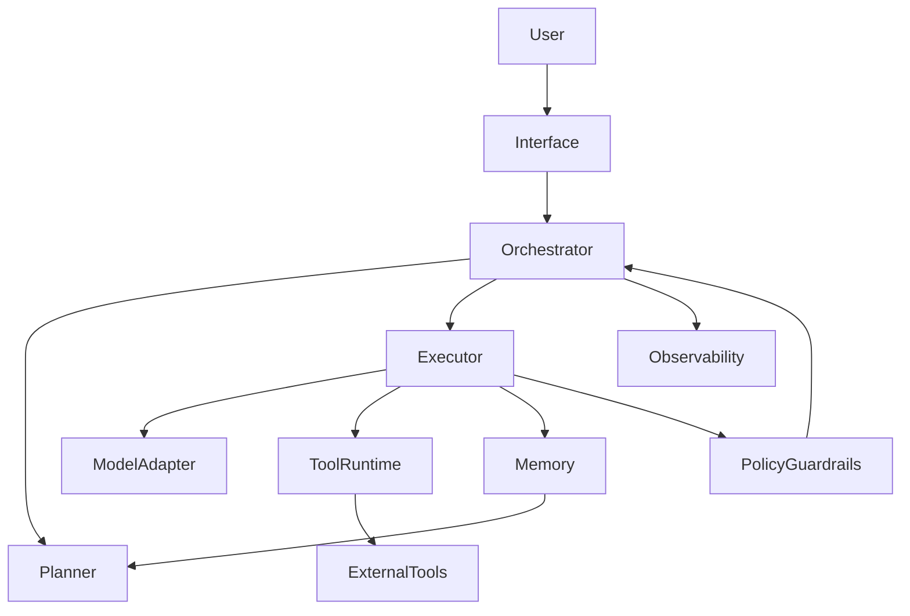
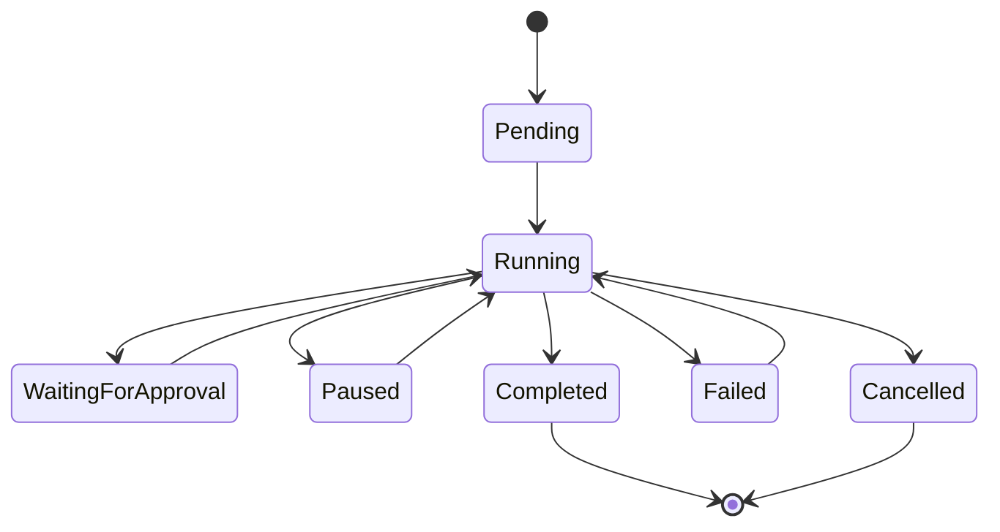
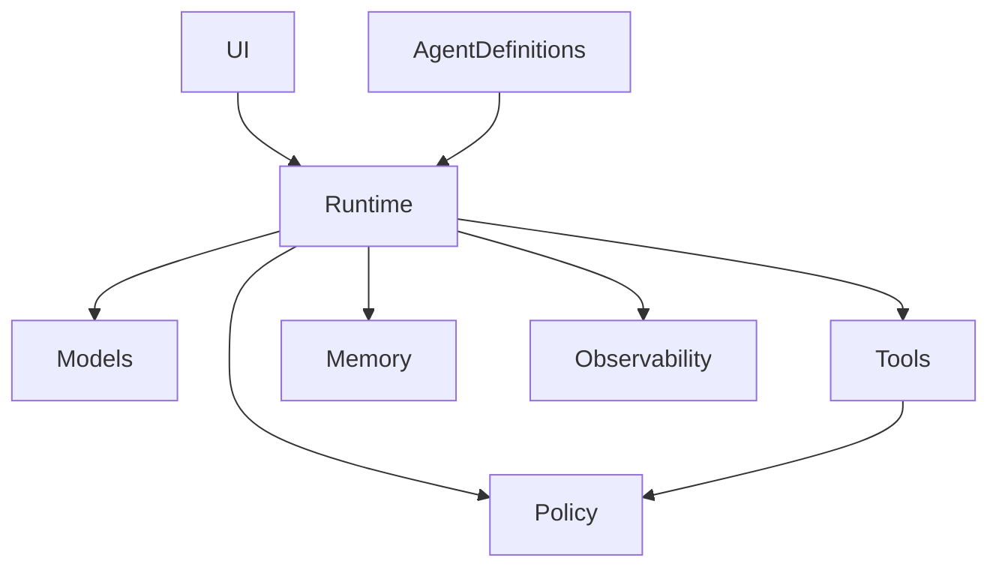

# Agent Framework Research And Build Guide

> 调研日期：2026-06-07。GitHub stars/forks 是热度快照，变化很快，只能说明社区关注度，不能直接等同于生产可用性。

这份文档面向想自己开发 Agent 的工程读者。目标不是堆项目名，而是回答四个问题：

1. 现在主流 Agent 项目分别解决什么问题？
2. 它们的架构思路、优劣势和适用场景是什么？
3. 如果自研 Agent，哪些设计问题必须提前想清楚？
4. 如何一步步做出一个架构分明、分层明确、职责清晰、低耦合高内聚的 Agent 系统？

## 1. 先定义 Agent

在工程语境里，Agent 不是“会聊天的 LLM”，而是一个能围绕目标循环决策、调用工具、观察结果、更新状态并继续执行的运行系统。

一个最小 Agent 通常包含：

| 模块 | 职责 | 常见失败 |
|---|---|---|
| `Instruction` | 定义角色、目标、边界和输出格式 | 指令过长、互相冲突、没有优先级 |
| `Model Adapter` | 封装模型调用、流式输出、重试、限流 | 厂商锁定、错误不可恢复、成本失控 |
| `Tool Registry` | 暴露可调用工具及参数 schema | 工具过多、权限不清、返回值不可预测 |
| `Planner` | 把目标拆成步骤或选择下一步动作 | 过度规划、计划不可执行、无法动态修正 |
| `Executor` | 执行一次模型调用或工具调用 | 状态混乱、错误吞掉、无法中断 |
| `Memory` | 保存短期上下文、长期事实、任务证据 | 注入太多噪声、过期记忆污染决策 |
| `Policy / Guardrails` | 权限、审批、安全、预算、边界控制 | 太松不安全，太严不可用 |
| `Observability` | 记录 trace、事件、成本、状态、产物 | 出问题无法复盘，无法评估效果 |

Agent 和传统 workflow 的区别在于：workflow 的路径通常由人提前定义；Agent 的路径可以由模型在运行时根据观察结果决定。但越接近生产，越不能把一切都交给模型自由发挥。好的 Agent 系统通常是“确定性骨架 + 模型决策点”的组合。

## 2. 生态地图

Agent 生态已经不是一个单一赛道。按工程形态可以分成七类：

| 类型 | 代表项目 | 核心价值 | 适合场景 |
|---|---|---|---|
| 通用编排框架 | `LangGraph`、`Semantic Kernel`、`Haystack` | 状态机、流程编排、工具集成 | 生产级复杂流程、企业应用 |
| 角色型多 Agent | `CrewAI`、`MetaGPT`、`AutoGen` / `AG2` | 多角色协作、任务分工、对话协商 | 快速原型、研究、多专家讨论 |
| 自治 Agent 平台 | `AutoGPT`、`Agno` | 长任务、自主执行、平台化运行 | 任务自动化平台、实验性自治系统 |
| Coding Agent | `OpenHands`、`SWE-agent`、`Cline`、`aider` | 理解代码库、编辑文件、运行测试 | 软件工程自动化 |
| 浏览器/工作流 Agent | `browser-use`、`n8n`、`Flowise` | 浏览器自动化、可视化流程、集成生态 | 网页操作、业务流程自动化 |
| 类型安全/轻量 SDK | `OpenAI Agents SDK`、`PydanticAI`、`smolagents`、`Vercel AI SDK`、`Mastra` | 更小抽象、更好开发体验 | 产品内嵌 Agent、轻量服务 |
| 记忆/语音专项框架 | `Letta`、`LiveKit Agents`、`LlamaIndex` | 长期记忆、实时语音、文档/RAG | 记忆型助手、语音 Agent、知识库 Agent |

### 热度快照

| 项目 | stars | forks | 语言 | 定位 |
|---|---:|---:|---|---|
| `n8n` | 191k | 58k | TypeScript | 工作流自动化平台，带 AI 能力 |
| `AutoGPT` | 185k | 46k | Python | 早期自治 Agent 代表，热度历史包袱较重 |
| `browser-use` | 98k | 11k | Python | 让 Agent 操作网站的浏览器自动化框架 |
| `OpenHands` | 76k | 10k | Python / TypeScript | AI 软件工程 Agent 平台 |
| `MetaGPT` | 69k | 9k | Python | 软件公司角色模拟式多 Agent |
| `Cline` | 63k | 7k | TypeScript | IDE/CLI/SDK 形态的 Coding Agent |
| `AutoGen` | 59k | 9k | Python | Microsoft 多 Agent 对话框架 |
| `CrewAI` | 53k | 7k | Python | 角色与任务驱动的多 Agent 框架 |
| `Flowise` | 53k | 24k | TypeScript | 可视化 LLM / Agent 工作流 |
| `LlamaIndex` | 50k | 8k | Python | 文档 Agent、RAG 和 OCR 平台 |
| `aider` | 46k | 5k | Python | 终端内 AI 结对编程 |
| `Agno` | 41k | 5k | Python | 构建、运行和管理 Agent 平台 |
| `LangGraph` | 34k | 6k | Python | 状态化长运行 Agent 编排框架 |
| `Semantic Kernel` | 28k | 5k | C# | Microsoft LLM 应用和 Agent 框架 |
| `smolagents` | 28k | 3k | Python | Hugging Face 轻量 code-first Agent |
| `OpenAI Agents SDK` | 27k | 4k | Python | 轻量多 Agent SDK，强调 handoff 和 guardrails |
| `Haystack` | 25k | 3k | Python / MDX | RAG、管线和 Agent 编排 |
| `Vercel AI SDK` | 25k | 5k | TypeScript | TypeScript AI 应用工具包 |
| `Mastra` | 25k | 2k | TypeScript | TypeScript Agent 应用框架 |
| `Letta` | 23k | 2k | Python | 状态和长期记忆 Agent 平台 |
| `PydanticAI` | 18k | 2k | Python | Pydantic 风格的类型安全 Agent 框架 |
| `SWE-agent` | 19k | 2k | Python | 面向 GitHub issue 修复和研究评测的 Coding Agent |
| `LiveKit Agents` | 11k | 3k | Python | 实时语音/视频 Agent 框架 |

## 3. 重点项目对比

### LangGraph

`LangGraph` 的核心思想是把 Agent 运行建模成显式图：节点负责计算，边负责状态转移，状态对象贯穿整个运行。它不是最容易上手的框架，但非常适合生产系统。

| 维度 | 评价 |
|---|---|
| 架构思想 | 显式状态机、节点、边、checkpoint、可中断执行 |
| 优势 | 控制力强、可测试、适合复杂分支、适合人类审批和恢复 |
| 短板 | 样板代码较多，学习成本高，简单任务会显得重 |
| 适合 | 生产级 Agent、复杂 DAG、长运行任务、多步骤审批 |
| 不适合 | 一小时内做 demo、简单问答、没有状态需求的小工具 |

如果你要自研生产 Agent，`LangGraph` 最值得学习的不是 API，而是它的“状态显式化”思想：任何关键决策都应该落在可观察状态上，而不是只存在模型上下文里。

### CrewAI

`CrewAI` 把 Agent 抽象成“角色 + 目标 + 任务”，非常符合人对团队协作的直觉。它适合快速做多 Agent 原型。

| 维度 | 评价 |
|---|---|
| 架构思想 | 角色扮演、多 Agent 分工、任务队列、流程编排 |
| 优势 | 上手快，概念直观，适合业务团队理解 |
| 短板 | 深度定制和复杂状态管理不如图式框架，隐式协调会带来 token 成本 |
| 适合 | 市场调研、内容生产、轻量业务自动化、多角色 demo |
| 不适合 | 强审计、复杂恢复、严格成本控制的生产核心链路 |

`CrewAI` 的启发是：Agent 的职责应该能被一句话说清楚。一个 Agent 如果既负责需求分析、编码、测试、审批、部署，又负责总结，很快会变成低内聚的大泥球。

### AutoGen / AG2

`AutoGen` 推广了“多 Agent 对话协作”的模式。`AG2` 是其社区演进方向之一，强调开放治理和多 Agent 编程模型。

| 维度 | 评价 |
|---|---|
| 架构思想 | 多个 Agent 通过消息互相协商，任务推进由对话驱动 |
| 优势 | 适合研究、辩论、专家互评、动态协商 |
| 短板 | 对话轮次可能膨胀，确定性和成本控制更难 |
| 适合 | 研究型 Agent、多专家讨论、复杂方案评审 |
| 不适合 | 标准业务流水线、成本敏感的高频生产任务 |

它的启发是：多 Agent 不一定等于更好。只有当任务真的需要不同视角、互相校验或并行探索时，多 Agent 才值得引入。

### AutoGPT

`AutoGPT` 是早期自治 Agent 热潮的代表，stars 很高，但更多反映历史影响力。它证明了“给目标 -> 自主规划 -> 调工具 -> 循环执行”的想象力，也暴露了失控、跑偏、成本高、结果不稳定等问题。

| 维度 | 评价 |
|---|---|
| 架构思想 | 长目标自治循环 |
| 优势 | 社区知名度高，启发性强 |
| 短板 | 生产确定性不足，旧式自治循环容易跑偏 |
| 适合 | 学习自治 Agent 的历史和反模式 |
| 不适合 | 直接作为严肃生产架构模板 |

自研时应避免“无限自主循环”。每轮循环都要有预算、停止条件、可观察状态和失败处理。

### MetaGPT

`MetaGPT` 把软件开发过程模拟成公司 SOP：产品经理、架构师、工程师、测试等角色依次产出文档和代码。

| 维度 | 评价 |
|---|---|
| 架构思想 | 角色化组织 + 标准操作流程 |
| 优势 | 对软件工程流程建模清晰，适合教学和端到端原型 |
| 短板 | 流程相对重，对真实复杂代码库的适配需要额外工程 |
| 适合 | 从自然语言需求生成软件设计、教学、多角色流程研究 |
| 不适合 | 高频小任务、需要深度接入现有工程系统的场景 |

它值得借鉴的是 SOP，而不是盲目复制“虚拟公司”。复杂任务需要过程资产：需求、方案、接口、测试计划、验收记录。

### OpenAI Agents SDK

`OpenAI Agents SDK` 的核心原语是 `Agents`、`Handoffs`、`Tools`、`Guardrails`、`Sessions`、`Tracing`。它比 LangGraph 更轻，比纯 API 调用更结构化。

| 维度 | 评价 |
|---|---|
| 架构思想 | 轻量多 Agent，强调 specialist handoff 和 guardrails |
| 优势 | 上手快，抽象少，跟 OpenAI tracing 和工具链结合紧密 |
| 短板 | 对复杂状态机和跨厂商深度控制不如 LangGraph |
| 适合 | Python 产品原型、客服分流、专家 handoff、轻量工具 Agent |
| 不适合 | 高度复杂的长运行图任务、强模型中立的底层平台 |

它的启发是：handoff 是多 Agent 的关键接口。不要让 Agent 直接共享全部上下文，而应传递结构化任务包。

### smolagents

`smolagents` 强调 code-first，让 Agent 用代码表达行动，而不是只走 JSON function calling。

| 维度 | 评价 |
|---|---|
| 架构思想 | 轻量、代码即行动、少量抽象 |
| 优势 | 简洁，适合 Hugging Face 生态，适合实验 |
| 短板 | 生产治理、权限和复杂编排需要自己补 |
| 适合 | 研究、小工具、代码执行型任务 |
| 不适合 | 企业级权限审计、多租户平台 |

它提醒我们：工具调用格式不是唯一重点，关键是动作是否可验证、可限制、可回放。

### PydanticAI

`PydanticAI` 面向喜欢 FastAPI/Pydantic 风格的 Python 开发者，强调类型、schema 和结构化输出。

| 维度 | 评价 |
|---|---|
| 架构思想 | 类型安全、结构化输出、依赖注入 |
| 优势 | 接口清晰，测试友好，适合后端服务 |
| 短板 | 不是重型多 Agent 编排平台 |
| 适合 | 类型严格的 Python Agent 服务、业务 API 内嵌 Agent |
| 不适合 | 大规模多 Agent 协商、复杂可视化工作流 |

它值得学习的是“schema first”：模型输出、工具输入、状态对象都应该有类型约束。

### Mastra / Vercel AI SDK

这两者代表 TypeScript 生态里的 Agent 开发路径。`Vercel AI SDK` 更像 AI 应用基础工具包，`Mastra` 更强调 Agent、workflow、RAG、observability 等应用框架能力。

| 维度 | 评价 |
|---|---|
| 架构思想 | TypeScript-native，面向 Web 产品和后端服务 |
| 优势 | 与现代前端/Node 栈贴合，适合产品化 |
| 短板 | Python 生态里的研究框架和模型工具更多 |
| 适合 | Next.js / Node 产品、Web app 内嵌 Agent、团队已有 TS 技术栈 |
| 不适合 | 主要依赖 Python ML/RAG 工具链的团队 |

选型时不要只看框架热度，要看团队主语言。Agent 是系统工程，最终会接数据库、队列、权限、日志、UI，不只是写 prompt。

### Agno

`Agno` 定位为构建、运行和管理 Agent 平台，关注运行时和控制平面。

| 维度 | 评价 |
|---|---|
| 架构思想 | Agent 平台化、运行管理、多 Agent runtime |
| 优势 | 更接近平台视角，适合多 Agent 管理 |
| 短板 | 相比轻量 SDK，上手和平台概念更重 |
| 适合 | 想构建 Agent 平台或内部自动化平台 |
| 不适合 | 只想写一个简单工具 Agent |

它的启发是：当 Agent 数量增加后，你需要的不是更多 prompt，而是控制平面：版本、配置、权限、运行记录、回滚和可观测性。

### LlamaIndex

`LlamaIndex` 从 RAG 和文档索引起家，现在覆盖文档 Agent、OCR、检索、数据连接器等。

| 维度 | 评价 |
|---|---|
| 架构思想 | 数据索引、检索增强、文档工作流 |
| 优势 | 文档和知识库生态强，适合企业数据 |
| 短板 | 不等于完整 Agent runtime，复杂执行治理仍需补充 |
| 适合 | 知识库问答、文档分析、RAG Agent |
| 不适合 | 浏览器/桌面/代码执行型 Agent 的完整平台 |

如果你的 Agent 主要价值来自“知道什么”，先重视 RAG；如果主要价值来自“能做什么”，先重视工具运行和权限。

### Semantic Kernel

`Semantic Kernel` 是 Microsoft 的 LLM 应用框架，C# 生态强，也支持 Python/Java。它适合在企业系统里组合技能、插件、规划器和模型调用。

| 维度 | 评价 |
|---|---|
| 架构思想 | 企业应用集成、插件、规划、Microsoft 生态 |
| 优势 | .NET 友好，适合企业后台 |
| 短板 | 对非 Microsoft 技术栈吸引力较弱 |
| 适合 | .NET 团队、Azure/Microsoft 生态、企业应用 |
| 不适合 | 纯 Python 快速研究、多 Agent 社区实验 |

### OpenHands

`OpenHands` 是开源 Coding Agent 里的重量级代表，目标是 AI-driven development，包含 SDK、CLI、GUI、评测等生态。

| 维度 | 评价 |
|---|---|
| 架构思想 | 给 Agent 一个软件工程工作台：文件、shell、浏览器、评测、任务上下文 |
| 优势 | 贴近真实开发流程，社区热度高，覆盖端到端软件工程 |
| 短板 | 系统复杂，安全隔离和运行成本需要认真管理 |
| 适合 | 自动修 bug、代码库任务、软件工程 Agent 平台 |
| 不适合 | 简单业务问答、没有代码执行需求的 Agent |

它对自研 Coding Agent 的启发非常直接：Agent 必须理解 workspace、能编辑文件、能运行命令、能读错误、能迭代验证，而不只是生成代码片段。

### SWE-agent

`SWE-agent` 主要面向从 GitHub issue 自动修复真实仓库问题，也常用于 SWE-bench 等研究评测。

| 维度 | 评价 |
|---|---|
| 架构思想 | Issue -> 代码库探索 -> 修改 -> 测试 -> 提交候选 |
| 优势 | 研究价值高，配置清晰，适合评测和实验 |
| 短板 | 更偏研究工具，产品化体验需要补 |
| 适合 | Coding Agent 研究、SWE-bench、自动修复实验 |
| 不适合 | 面向普通用户的完整 IDE 体验 |

它的核心启发是评测闭环：Coding Agent 必须用测试、lint、diff、日志来证明自己，而不能只靠自然语言总结。

### Cline / aider

`Cline` 和 `aider` 都是开发者常用 Coding Agent。`Cline` 更偏 IDE/扩展/SDK 形态，`aider` 更偏终端结对编程。

| 项目 | 优势 | 短板 | 适合 |
|---|---|---|---|
| `Cline` | IDE 体验强，工具化完整，社区热 | 与编辑器环境绑定较强 | VS Code / IDE 内工程任务 |
| `aider` | 终端体验成熟，git 工作流清晰 | UI 和多 Agent 控制面较弱 | 命令行开发者、结对编程 |

自研 Coding Agent 时，必须尊重开发者工作流：diff 可读、命令可复现、测试可追踪、失败能解释。

### browser-use

`browser-use` 让 Agent 能理解并操作网页，是浏览器自动化 Agent 的代表。

| 维度 | 评价 |
|---|---|
| 架构思想 | 浏览器状态、DOM/截图、动作执行、观察反馈 |
| 优势 | 专注网页任务，热度高，适合自动化在线操作 |
| 短板 | 网页状态不可控，登录、验证码、反爬、权限问题复杂 |
| 适合 | 网页表单、后台操作、数据采集、在线流程 |
| 不适合 | 对稳定性和合规要求极高但没有人工接管的场景 |

浏览器 Agent 最大的坑是“看起来能点，实际不可靠”。需要截图、可访问性树、DOM、网络状态、重试策略和人工接管。

### n8n / Flowise

`n8n` 和 `Flowise` 都偏可视化。`n8n` 是通用 workflow 自动化平台，`Flowise` 更聚焦 LLM/Agent 工作流。

| 项目 | 优势 | 短板 | 适合 |
|---|---|---|---|
| `n8n` | 集成多、可视化强、自托管 | Agent 自主性不是核心 | 业务自动化、系统集成 |
| `Flowise` | 快速搭建 LLM/Agent 流程 | 复杂工程治理有限 | demo、低代码 AI workflow |

它们的启发是：很多任务不需要 Agent。能用确定性 workflow 解决的，就不要引入不稳定的模型决策。

### Letta / LiveKit Agents

`Letta` 关注长期状态和记忆，`LiveKit Agents` 关注实时语音/视频 Agent。

| 项目 | 核心能力 | 适合 |
|---|---|---|
| `Letta` | 状态化 Agent、长期记忆、自学习 | 个人助手、长期关系型 Agent |
| `LiveKit Agents` | 实时语音、低延迟交互、多媒体会话 | 语音客服、实时会议、电话 Agent |

它们提醒我们：Agent 架构必须围绕场景优化。记忆型 Agent 的核心是事实更新和遗忘；语音 Agent 的核心是延迟、中断、实时性和对话状态。

## 4. 横向对比

### 按使用目的选

| 目标 | 优先考虑 | 原因 |
|---|---|---|
| 快速做一个多 Agent demo | `CrewAI`、`OpenAI Agents SDK` | 抽象直观，启动快 |
| 做生产级复杂流程 | `LangGraph` | 状态、分支、checkpoint、恢复能力强 |
| 做多专家讨论/研究 | `AutoGen` / `AG2` | 对话协作模型自然 |
| 做 Coding Agent | `OpenHands`、`SWE-agent`、`Cline`、`aider` | 已围绕代码库、shell、diff、测试优化 |
| 做浏览器自动化 | `browser-use` | 专注网页操作反馈循环 |
| 做知识库 Agent | `LlamaIndex`、`Haystack` | 文档索引、检索和数据连接能力强 |
| 做 TypeScript 产品 | `Mastra`、`Vercel AI SDK` | 与 Web/Node 技术栈贴合 |
| 做类型严格后端 | `PydanticAI` | schema 和类型约束清晰 |
| 做语音 Agent | `LiveKit Agents` | 实时音视频基础设施成熟 |
| 做长期记忆 Agent | `Letta` | 状态和长期记忆模型明确 |

### 按工程成熟度看

| 维度 | 最强候选 | 说明 |
|---|---|---|
| 显式状态管理 | `LangGraph` | 把运行状态建模成图状态 |
| 快速原型 | `CrewAI`、`OpenAI Agents SDK` | 概念少，样板代码少 |
| 多 Agent 对话 | `AutoGen` / `AG2` | 消息驱动协作 |
| 代码工程闭环 | `OpenHands`、`SWE-agent`、`aider` | 文件、命令、测试、diff 是一等能力 |
| 类型安全 | `PydanticAI` | Pydantic schema 贯穿输入输出 |
| Web 产品集成 | `Mastra`、`Vercel AI SDK` | TypeScript 生态 |
| 数据/RAG | `LlamaIndex`、`Haystack` | 检索和文档处理生态 |
| 可视化工作流 | `n8n`、`Flowise` | 非工程用户更容易搭建 |

### 常见误区

| 误区 | 正确理解 |
|---|---|
| stars 越高越适合 | stars 反映热度，不反映你的场景适配度 |
| 多 Agent 一定比单 Agent 强 | 多 Agent 会增加协调成本、上下文成本和不确定性 |
| Agent 可以替代所有 workflow | 稳定流程优先用确定性 workflow，Agent 只处理不确定部分 |
| 加 Memory 就会更聪明 | 低质量记忆会污染决策，记忆需要分层、过期和审计 |
| 工具越多越强 | 工具越多，选择成本、权限风险和 prompt 面积越大 |
| prompt 写好就能生产 | 生产系统需要状态、权限、日志、评测、回滚、预算 |

## 5. 自研 Agent 的设计原则

### 5.1 先定边界，再写代码

自研前先回答：

| 问题 | 示例 |
|---|---|
| Agent 的用户是谁？ | 开发者、运营、客服、普通消费者 |
| Agent 的主要任务是什么？ | 修代码、查资料、填表单、写报告、操作内部系统 |
| 成功标准是什么？ | 测试通过、表单提交成功、报告可读、工单关闭 |
| 允许调用哪些工具？ | shell、浏览器、数据库、HTTP、文件系统、MCP |
| 哪些动作必须审批？ | 删除、提交、付款、发消息、导出敏感数据 |
| 状态保存多久？ | 单轮、会话、任务、用户长期记忆、组织知识库 |
| 如何评估质量？ | 自动测试、人工打分、任务成功率、成本、延迟 |

如果这些问题不清楚，代码越多越难收拾。

### 5.2 分层架构

推荐把 Agent 系统拆成以下层：



| 层 | 只负责什么 | 不应该负责什么 |
|---|---|---|
| `Interface` | 接收用户输入、展示状态、收集审批 | 不直接拼 prompt，不直接调工具 |
| `Orchestrator` | 管任务生命周期、状态转移、暂停恢复 | 不包含具体工具实现 |
| `Planner` | 生成计划、选择下一步、更新计划 | 不直接执行副作用 |
| `Executor` | 执行一步模型或工具调用 | 不决定全局权限策略 |
| `ModelAdapter` | 封装模型厂商差异 | 不知道业务流程 |
| `ToolRuntime` | 工具注册、参数校验、执行、结果标准化 | 不做高层任务规划 |
| `Memory` | 读写事实、证据、摘要、向量检索 | 不无脑注入所有历史 |
| `PolicyGuardrails` | 权限、预算、审批、敏感操作拦截 | 不混入业务 prompt |
| `Observability` | trace、事件、日志、成本、评测 | 不影响业务决策，除非通过明确策略 |

低耦合的关键是：每一层通过结构化对象通信，而不是互相传一大段自然语言。

### 5.3 状态是第一等公民

不要让 Agent 的真实状态只存在 prompt 里。至少要有：

```ts
interface AgentRunState {
  runId: string;
  userGoal: string;
  status: "pending" | "running" | "waiting_for_approval" | "completed" | "failed" | "cancelled";
  plan: PlanStep[];
  currentStepId?: string;
  observations: Observation[];
  toolCalls: ToolCallRecord[];
  approvals: ApprovalRequest[];
  artifacts: Artifact[];
  budgets: BudgetState;
  error?: AgentError;
}
```

状态对象应该能回答：

- 现在运行到哪一步？
- 为什么选择这一步？
- 调用了哪些工具？
- 哪些结果是外部不可信输入？
- 花了多少钱和多少 token？
- 是否在等用户审批？
- 失败后能从哪里恢复？

### 5.4 工具必须像 API 一样设计

工具不是随便暴露给模型的函数。每个工具都应该有：

| 要素 | 说明 |
|---|---|
| 名称 | 动词明确，例如 `read_file`、`create_pull_request` |
| 描述 | 说明何时使用、何时不要使用 |
| 输入 schema | 必填字段、枚举、限制、默认值 |
| 输出 schema | 成功、失败、部分成功的结构 |
| 权限等级 | read-only、write、destructive、external-send |
| 幂等性 | 重试是否安全 |
| 超时 | 防止工具卡死 |
| 审计 | 记录调用者、参数摘要、结果摘要 |

工具返回值要短、结构化、可引用。不要把几万行日志直接塞回模型上下文，应该保存成 artifact，再返回摘要和路径。

### 5.5 Prompt 是配置，不是架构

Prompt 应该放在可版本化、可测试、可替换的位置。推荐拆成：

| Prompt 区块 | 内容 |
|---|---|
| `system_identity` | Agent 身份和总原则 |
| `task_contract` | 当前任务目标和验收标准 |
| `tool_policy` | 可用工具、限制、审批规则 |
| `memory_context` | 经过筛选的相关记忆 |
| `runtime_state` | 当前计划、观察、错误、预算 |
| `output_contract` | 输出格式和下一步动作 |

不要在一个巨大 system prompt 里混合身份、权限、任务、历史、工具说明和输出格式。那会让后续维护非常痛苦。

### 5.6 Memory 要分层

推荐把记忆分成四层：

| 层 | 内容 | 注入方式 |
|---|---|---|
| L0 热记忆 | 用户偏好、稳定事实、当前项目关键约束 | 默认注入，严格限长 |
| L1 任务记忆 | 最近任务摘要、当前 run 观察、已确认事实 | 当前任务内注入 |
| L2 主题包 | 某个主题的知识集合 | 按需检索后注入 |
| L3 原始证据 | 历史 transcript、文件、日志、网页 | 工具读取，不默认注入 |

记忆需要有来源、时间、置信度和删除/纠错机制。否则 Agent 会把旧事实当新事实，把错误总结当真相。

### 5.7 安全和权限不能后补

Agent 的危险来自“模型可以决定动作”。至少要做：

| 风险 | 控制 |
|---|---|
| 删除/覆盖文件 | 审批、diff 展示、回滚 |
| 执行 shell | 命令 allowlist/denylist、工作目录限制、超时 |
| 发送消息/邮件 | 收件人确认、内容预览、人工批准 |
| 网络请求 | 域名策略、数据导出审批 |
| 读取敏感文件 | secret 探测、脱敏、禁止外传 |
| 长循环失控 | turn limit、预算、心跳、取消 |
| Prompt injection | 外部内容标记为 untrusted，不允许覆盖系统指令 |

最好的设计是 fail closed：无法判断权限时拒绝，而不是默认放行。

## 6. 从零开发路线

下面是一条可落地路线，适合从 MVP 逐步演进到生产架构。

### 阶段 0：最小可运行 Agent

目标：用户输入任务，Agent 调模型，返回答案。

需要实现：

- `ModelAdapter.generate(messages)`
- `Agent.run(userInput)`
- 基础日志
- 单元测试覆盖模型 adapter 的 mock

不要一开始就做多 Agent、长期记忆和复杂工具。先保证调用链清楚。

### 阶段 1：加入工具调用

目标：Agent 可以调用少量 read-only 工具。

推荐工具：

- `search_web`
- `read_file`
- `list_files`
- `get_current_time`

实现要点：

1. 用 JSON schema 定义工具参数。
2. 工具执行前做参数校验。
3. 工具结果统一成 `ToolResult`。
4. 每次工具调用写入 `toolCalls` 记录。
5. 限制最大工具调用轮次。

```ts
interface Tool<I, O> {
  name: string;
  description: string;
  inputSchema: unknown;
  permission: "read" | "write" | "destructive" | "external_send";
  execute(input: I, context: ToolContext): Promise<ToolResult<O>>;
}
```

验收标准：给一个需要查文件或查网页的任务，Agent 能选择正确工具，并基于结果回答。

### 阶段 2：引入任务状态和事件流

目标：运行过程可观察、可恢复、可展示。

新增：

- `AgentRun`
- `AgentRunState`
- `RunEvent`
- `EventStore`

事件示例：

```ts
type RunEvent =
  | { type: "run.started"; runId: string; goal: string }
  | { type: "model.called"; runId: string; model: string; tokens?: number }
  | { type: "tool.called"; runId: string; toolName: string; inputSummary: string }
  | { type: "tool.completed"; runId: string; toolName: string; outputSummary: string }
  | { type: "approval.requested"; runId: string; approvalId: string }
  | { type: "run.completed"; runId: string; summary: string }
  | { type: "run.failed"; runId: string; error: AgentError };
```

验收标准：任何一次 Agent 运行都能回放发生过什么。

### 阶段 3：加入 Planner / Executor 分离

目标：规划和执行解耦。

推荐接口：

```ts
interface Planner {
  createPlan(input: PlanningInput): Promise<Plan>;
  revisePlan(input: PlanRevisionInput): Promise<Plan>;
}

interface Executor {
  executeStep(input: ExecuteStepInput): Promise<StepResult>;
}
```

Planner 不直接调工具，只产出计划。Executor 不重新定义目标，只执行当前步骤。这样可以单独测试计划质量，也可以在执行失败后只修订局部计划。

验收标准：Agent 能先给出步骤，再逐步执行，并在失败时修改后续步骤。

### 阶段 4：加入权限和审批

目标：写操作和危险操作必须经过策略层。

实现：

- `PolicyEngine.evaluate(action)`
- `ApprovalService.requestApproval(action)`
- `ApprovalService.resolve(approvalId, decision)`
- UI 或 CLI 展示审批内容

策略结果：

```ts
type PolicyDecision =
  | { kind: "allow" }
  | { kind: "deny"; reason: string }
  | { kind: "require_approval"; reason: string; approvalPreview: string };
```

验收标准：Agent 想执行 `write_file`、`send_email`、`delete_file`、`run_shell` 时，系统能按策略允许、拒绝或请求审批。

### 阶段 5：加入短期记忆和证据管理

目标：Agent 不需要在 prompt 里携带所有历史，也能引用任务证据。

实现：

- 当前 run 的 observations
- artifact 存储
- 摘要器
- 检索接口

原则：

- 原始大文件不直接注入 prompt。
- 每个观察结果都记录来源。
- 外部网页、用户上传文件、邮件内容都标记为 untrusted。
- 总结可以用，但必须能追溯原文。

验收标准：长任务中 Agent 能引用前面工具结果，但 prompt 不无限膨胀。

### 阶段 6：引入长期记忆

目标：跨任务保存稳定事实和用户偏好。

先做保守版本：

- 只保存明确、稳定、可验证的事实。
- 默认需要用户确认或来自高置信来源。
- 提供查看、修改、删除。
- 检索结果按相关性和新鲜度排序。

不要保存：

- 一次性任务细节
- 模型猜测
- 未确认的用户隐私
- 已过期的项目状态

验收标准：Agent 能记住用户偏好，但用户能看到和纠正这些记忆。

### 阶段 7：状态机和可恢复执行

目标：任务可以暂停、恢复、重试。

运行状态建议：



需要保存：

- 当前计划
- 当前步骤
- 已完成工具调用
- 待审批动作
- 错误分类
- 可重试点

验收标准：进程重启后，Agent 能知道自己之前做到哪一步，而不是重新开始。

### 阶段 8：多 Agent

目标：只有在任务复杂度值得时，引入多个专业 Agent。

推荐角色：

| 角色 | 职责 |
|---|---|
| `LeadAgent` | 拆任务、分配、汇总、控制质量 |
| `ResearchAgent` | 查资料、收集证据 |
| `EngineerAgent` | 修改代码、运行测试 |
| `ReviewerAgent` | 审查方案、找风险 |
| `OperatorAgent` | 执行部署、监控、回滚 |

多 Agent 通信不要共享全部上下文，使用结构化交接：

```ts
interface AgentHandoff {
  fromAgent: string;
  toAgent: string;
  task: string;
  contextSummary: string;
  constraints: string[];
  artifacts: ArtifactRef[];
  expectedOutput: string;
  deadline?: string;
}
```

验收标准：每个子 Agent 有明确输入输出，LeadAgent 能追踪子任务状态和质量。

### 阶段 9：评测系统

目标：知道 Agent 是否真的变好。

评测维度：

| 维度 | 指标 |
|---|---|
| 成功率 | 任务完成、测试通过、人工验收 |
| 成本 | token、模型费用、工具费用 |
| 延迟 | 首 token、总耗时、工具耗时 |
| 稳定性 | 重试次数、失败率、恢复成功率 |
| 安全 | 审批触发率、拒绝率、越权尝试 |
| 用户体验 | 追问次数、人工修正次数、满意度 |

Coding Agent 至少要有：

- 固定 benchmark 任务
- 自动运行测试
- diff 检查
- lint/typecheck
- 回归集

### 阶段 10：生产化

生产版需要：

- 多模型路由和降级
- 成本预算和熔断
- 队列和并发控制
- 租户/用户隔离
- secret 管理
- 审计日志
- 版本化 prompt
- 工具权限配置
- 数据保留策略
- 监控告警
- 人工接管
- 灰度发布

到这一步，Agent 已经不是一个脚本，而是一个运行平台。

## 7. 推荐目录结构

一个通用 TypeScript Agent 项目可以这样拆：

```text
src/
  agents/
    definitions/
    handoffs/
    prompts/
  runtime/
    orchestrator.ts
    planner.ts
    executor.ts
    state-machine.ts
    event-store.ts
  models/
    model-adapter.ts
    providers/
      openai.ts
      anthropic.ts
      local.ts
  tools/
    registry.ts
    schemas.ts
    file-tools.ts
    shell-tools.ts
    browser-tools.ts
  memory/
    short-term.ts
    long-term.ts
    retriever.ts
    summarizer.ts
  policy/
    policy-engine.ts
    approval-service.ts
    redaction.ts
  observability/
    tracing.ts
    metrics.ts
    run-log.ts
  evals/
    cases/
    runner.ts
    scorers.ts
  ui/
    run-view/
    approval-panel/
```

如果用 Python，结构类似：

```text
agent_app/
  agents/
  runtime/
  models/
  tools/
  memory/
  policy/
  observability/
  evals/
  api/
```

关键不是目录名字，而是依赖方向：



避免反向依赖。例如工具层不应该 import UI，模型 adapter 不应该知道业务任务，memory 不应该直接决定是否允许发邮件。

## 8. 接口设计建议

### Agent Definition

```ts
interface AgentDefinition {
  id: string;
  name: string;
  description: string;
  instructions: string;
  modelPolicy: ModelPolicy;
  allowedTools: string[];
  memoryPolicy: MemoryPolicy;
  approvalPolicy: ApprovalPolicy;
  maxTurns?: number;
}
```

### Runtime Contract

```ts
interface AgentRuntime {
  start(input: StartRunInput): Promise<AgentRun>;
  resume(runId: string): Promise<AgentRun>;
  cancel(runId: string): Promise<void>;
  sendUserMessage(runId: string, message: string): Promise<void>;
  approve(approvalId: string, decision: ApprovalDecision): Promise<void>;
  subscribe(runId: string): AsyncIterable<RunEvent>;
}
```

### Tool Result

```ts
interface ToolResult<T> {
  ok: boolean;
  data?: T;
  error?: {
    code: string;
    message: string;
    retryable: boolean;
  };
  summary: string;
  artifacts?: ArtifactRef[];
  provenance?: {
    source: "user" | "workspace" | "web" | "tool" | "external";
    trusted: boolean;
  };
}
```

### Observation

```ts
interface Observation {
  id: string;
  createdAt: string;
  source: string;
  summary: string;
  artifactRefs: ArtifactRef[];
  trusted: boolean;
}
```

这些接口能让模型上下文、工具结果、UI 展示、日志审计共享同一套事实，而不是每层各写一套临时格式。

## 9. 开发时最该注意的问题

### 9.1 不要让 Orchestrator 变成上帝类

Orchestrator 只管理生命周期和状态转移，不要把 prompt 拼接、工具实现、记忆检索、安全策略都塞进去。否则后期改任何东西都会牵一发动全身。

### 9.2 不要把 Memory 当垃圾桶

保存记忆前要问：

- 这是不是稳定事实？
- 有没有来源？
- 什么时候过期？
- 用户能否查看和删除？
- 下次任务真的需要它吗？

### 9.3 不要让工具无权限边界

`read_file` 和 `delete_file` 不是同一类能力。`send_email` 和 `draft_email` 也不是同一类能力。每个工具都要有权限等级和审批策略。

### 9.4 不要过早多 Agent

先把单 Agent 的状态、工具、观察、评测做好。多 Agent 只在这些情况值得引入：

- 需要并行探索多个方案
- 需要独立 reviewer 降低错误
- 任务天然有不同专业角色
- 子任务之间可以明确交接

### 9.5 不要只依赖自然语言计划

自然语言计划适合给人看，但系统执行应有结构化计划：

```ts
interface PlanStep {
  id: string;
  title: string;
  status: "pending" | "in_progress" | "completed" | "failed" | "skipped";
  owner?: string;
  dependsOn: string[];
  expectedOutcome: string;
  evidenceRequired: string[];
}
```

### 9.6 不要忽视取消和暂停

Agent 一旦能长时间运行，就必须支持：

- 用户取消
- 用户暂停
- 等待审批
- 超时停止
- 预算耗尽停止
- 失败后恢复

### 9.7 不要把评测放到最后

每做一个能力，都要配一个小评测：

- 工具选择是否正确？
- 参数是否符合 schema？
- 是否触发了应有审批？
- 是否能从工具错误中恢复？
- 是否能生成可验证结果？

## 10. MVP 到生产路线图

| 阶段 | 目标 | 必做 | 暂不做 |
|---|---|---|---|
| MVP | 能完成单轮或少量工具任务 | 模型调用、工具注册、日志、轮次限制 | 长期记忆、多 Agent |
| 可用版 | 能执行多步任务 | 状态、计划、工具结果、错误处理、短期记忆 | 大规模并发 |
| 安全版 | 能处理写操作 | 权限、审批、敏感数据、审计 | 完全自治 |
| 专业版 | 面向具体场景优化 | 领域工具、评测集、UI、artifact 管理 | 泛化到所有任务 |
| 生产版 | 可多人/多任务稳定运行 | 队列、预算、监控、恢复、版本、租户隔离 | 无限制开放工具 |
| 平台版 | 支持多个 Agent 和团队协作 | Agent registry、handoff、控制面、运行历史 | 让模型自由管理所有策略 |

## 11. 推荐学习路径

如果你从零开始：

1. 先读 `OpenAI Agents SDK` 或 `PydanticAI`，理解最小 Agent、工具和结构化输出。
2. 再读 `LangGraph`，学习状态机、checkpoint、人类审批和恢复。
3. 再看 `CrewAI` / `MetaGPT`，理解角色拆分和多 Agent 协作。
4. 如果关注 Coding Agent，重点研究 `OpenHands`、`SWE-agent`、`aider`、`Cline`。
5. 如果关注浏览器，研究 `browser-use` 的观察和动作循环。
6. 如果关注知识库，研究 `LlamaIndex` 和 `Haystack` 的检索管线。
7. 最后回到自己的场景，设计最小可用架构，不要照搬任何一个框架。

## 12. 最终建议

如果你要自研一个架构清晰的 Agent，推荐采用以下策略：

- 用 `LangGraph` 学状态化编排思想，但不要一开始就做过重框架。
- 用 `CrewAI` 学角色拆分，但不要迷信多 Agent。
- 用 `PydanticAI` 学类型和 schema，把所有边界结构化。
- 用 `OpenHands` / `SWE-agent` 学 Coding Agent 的验证闭环。
- 用 `n8n` 学确定性 workflow，避免把所有流程都 Agent 化。
- 用 `Letta` 和 CoWork OS 的分层记忆思路理解长期记忆治理。

真正可靠的 Agent 架构不是“让模型更自由”，而是把自由限制在可观察、可恢复、可审批、可评测的边界内。模型负责处理不确定性，系统负责确定性、边界和证据。

一套好的 Agent 系统应该做到：

- 用户目标清晰
- 状态显式保存
- 工具权限明确
- 计划可检查
- 过程可观察
- 结果可验证
- 失败可恢复
- 记忆可治理
- 成本可控制
- 架构可演进

做到这些以后，再谈多 Agent、自治、长期学习和平台化，才不会变成不可维护的 prompt 堆叠。
