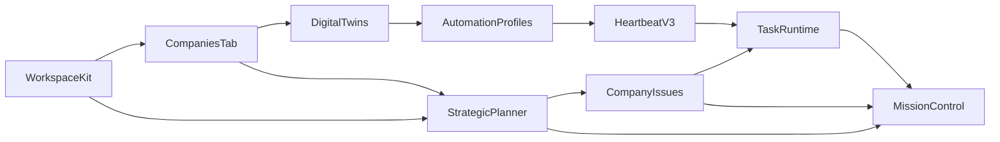

# Zero-Human Company Operations

CoWork OS can be configured as a founder-operated autonomous company shell: a small team of persistent AI operators that continuously review goals, generate work, execute tasks, and surface outcomes through Mission Control.

This is not a claim that the product removes human judgment from all business operations. The design target is "human-directed, agent-operated" execution:

- humans define strategy, guardrails, and irreversible approval policy
- agents turn strategy into ongoing operational work
- Mission Control provides visibility into planning, execution, and review

  
   <em>Company workspaces track goals, operator agents, and autonomous operating loops.</em>

---

## What This Feature Is

The zero-human-company workflow is a composition of existing CoWork OS subsystems:

- `Workspace Kit` provides durable company context in `.cowork/`
- `Settings > Companies` provides the control surface for creating companies, editing the company graph, and linking operators
- `Digital Twins` provide optional persistent operator personas
- `Automation Profiles` attach always-on ownership to the selected operator roles
- `Heartbeat v3` gives those operators cheap Pulse review plus selective Dispatch escalation
- `Strategic Planner` turns goals and stalled work into managed issues
- `Mission Control` lets you monitor agents, issues, runs, and tasks
- `Workflow Intelligence` can continuously reflect across company workflows, run Dreaming over memory drift and corrections, then surface reviewable suggestions, memory candidates, or trusted low-risk tasks
- `Devices` can route execution to dedicated remote machines while the company graph and planner stay on the primary control surface

Together, these create an operating loop where company goals become planner-managed issues, issues become tasks, and tasks are executed by role-specific agents with configurable autonomy.

---

## Foundation

### 1. Company Context Layer

The `venture_operator` workspace kit preset seeds structured company memory into `.cowork/`:

- `COMPANY.md`
- `OPERATIONS.md`
- `KPIS.md`
- `PRIORITIES.md`
- `HEARTBEAT.md`

These files are injected into agent context so operators reason from company state instead of acting like generic assistants.

### 2. Persistent Operator Roles

Operator agents are implemented as `AgentRole` records with:

- capability and tool settings
- role-specific prompts
- persisted optional `companyId` assignment
- optional `autonomyPolicy`
- optional twin/persona metadata embedded in the agent `soul`

Always-on ownership now lives in a separate `AutomationProfile`, which carries cadence, cooldown, budget, active hours, and heartbeat profile for the chosen operator role.

The venture/operator templates include:

- `Founder Office Operator`
- `Company Planner`
- `Growth Operator`
- `Customer Ops Lead`

### 3. Strategic Planning Layer

The strategic planner stores:

- planner config per company
- planner runs
- planner-managed issue metadata

It periodically examines company goals, projects, and open issues, then:

- creates missing execution issues
- updates stale planner-managed issues
- optionally dispatches those issues into runnable tasks

### 4. Execution Layer

Planner-created work does not use a special runtime. It flows through the same task runtime as the rest of CoWork OS:

- planning
- execution
- approvals
- worktree isolation where required
- timeline events
- outputs and artifacts

This is important because it means ZHC operation is not a separate prototype path. It uses the same production-grade agent runtime, guardrails, and monitoring surfaces as normal tasks.

### 5. Monitoring Layer

Mission Control exposes the operating loop through:

- left panel: live agents and pulse/dispatch state
- center panel: execution task board
- right panel: feed, task detail, and `Ops`
- planner strip: planner config, manual run trigger, recent planner cycles
- ops tab: goals, projects, planner-managed issues, linked tasks, issue runs, and run events

`Settings > Companies` complements that monitoring layer with:

- company creation and metadata editing
- company graph editing for goals, projects, and issues
- linked operator visibility
- direct handoff into company-scoped Digital Twins and Mission Control views
- a stable human-facing source of truth before planner cycles or operator runs begin

---

## Integrations With Existing Features

### Digital Twins

Digital twins are the main way to instantiate company operators as persona presets. The ZHC workflow uses the same activation flow as any other twin, but swaps in venture/operator personas and company-aware prompts.

When a twin is created from company context, CoWork OS now persists the company assignment on the resulting `AgentRole`. That lets the product consistently show:

- which operators belong to which company
- company-scoped operator sections in `Settings > Digital Twins`
- linked operators in `Settings > Companies`
- preselected company context when hopping into Mission Control

If that role should become always-on, attach a separate automation profile after activation. This keeps persona choice separate from core cognition ownership.

### Settings > Companies

The `Companies` tab is the setup and maintenance surface for the company graph. Use it to:

- create a company shell
- edit company metadata and budget state
- manage goals, projects, and issues
- assign or unassign existing twins as company operators
- jump directly into company-scoped Digital Twins or Mission Control

In practice, `Settings > Companies` is now the first screen to open for company work. It is where you define the graph, confirm linked operators, and hand off into Mission Control after setup.

### Workspace Kit

The ZHC setup depends heavily on `.cowork/` files. The workspace kit is the durable strategy and operating-memory layer for the company.

### Heartbeat Maintenance

`HEARTBEAT.md` is a recurring checklist input for Heartbeat v3. Automation-profile-backed operators can treat it as company-ops maintenance work without creating a second automation system, while persona-only roles stay on-demand.

### Mission Control

Mission Control is the operational cockpit:

- planner controls
- company selection
- Heartbeat-enabled operator state
- global runtime queue status for running/waiting execution
- Mission Board tracked work for the selected workspace/company context
- manual planner execution
- planner cycle review
- issue inspection
- run inspection
- linked task navigation

### Devices

If your operator tasks need to run on another machine, use the Devices tab alongside the company workflow:

- keep company planning and graph editing on the main machine
- connect dedicated remotes for execution-heavy tasks
- inspect remote task history without losing company context
- attach files from remote workspaces when dispatching company tasks

### Workflow Intelligence

`Workflow Intelligence` is optional but complementary to the planner/operator stack. It is part of the core automation runtime and can reflect on company workflow evidence across:

- planner-created work
- inbox and mailbox signals
- scheduled tasks and briefings
- event-trigger evidence
- git-backed code workspaces

It works especially well when:

- the company loop already has stable briefs, schedules, or operator cadence
- Dreaming can use recurring company evidence to propose memory cleanup, durable constraints, open loops, and ignored-noise patterns
- you want explicit hypotheses, critique, a winner, and a next-step backlog instead of ad hoc background suggestions
- code-change dispatch can run in git-backed workspaces with worktrees available

### Channels and External Systems

Zero-human-company operation becomes more powerful when combined with:

- messaging channels
- email
- web automation
- MCP connectors
- scheduling and briefings

That lets operators monitor customer-facing systems, inboxes, project tools, or external workflows without changing the internal company-ops model.

---

## How It Works End To End

Operational sequence:

1. You define company context in `.cowork/`.
2. You create or select the company shell in `Settings > Companies`.
3. You activate operator agents from venture-oriented persona templates.
4. Those twins are persisted with company assignment.
5. You attach automation profiles to the operator roles that should become always-on.
6. Heartbeat v3 runs only for those automation-profile participants and Dispatches only when justified.
7. The strategic planner reviews goals, projects, and open issues.
7. The planner creates or updates planner-managed issues.
8. If auto-dispatch is enabled, issues become executable tasks.
9. Agents execute the tasks through the normal runtime.
10. Mission Control reflects the resulting tasks, issues, runs, and planner activity.

---

## Core Components

### Venture Operator Workspace Kit

Use `Settings` -> `Memory Hub` and choose `Venture operator kit`.

This preset creates richer company-operating files than the default workspace kit and is the recommended foundation for ZHC-style use.

### Venture Operator Personas

The built-in operator templates cover a basic founder-led company loop:

| Persona | Primary responsibility |
|--------|-------------------------|
| `Founder Office Operator` | Cross-functional operator, routing and escalation, founder proxy |
| `Company Planner` | Translates goals into projects, issues, and follow-up work |
| `Growth Operator` | Funnel, acquisition, experiments, and outbound opportunities |
| `Customer Ops Lead` | Service quality, support load, and unresolved commitments |

### Operational Autonomy Policy

Operator roles can carry an `autonomyPolicy` that controls:

- autonomous mode
- approval presets
- allowed auto-approval types
- whether user input is allowed

Core-created automated tasks now inherit a real autonomy policy instead of only disabling prompts. Routine operator work can auto-approve common safe actions, while hard guardrails and workspace capability denials still remain enforced.
- whether a worktree is required

This is how "founder-edge" operation is modeled without making every task globally fully autonomous.

### Strategic Planner Service

The planner service persists:

- planner config per company
- planner run history
- planner-managed issue metadata

It is exposed both through the control plane and Mission Control desktop IPC.

### Control Plane Company Model

The planner and Mission Control operate over a company graph of:

- companies
- goals
- projects
- issues
- runs
- comments

This is the internal company-operations model that makes company-level visibility possible.

### Companies Settings Surface

The desktop `Companies` tab is the human-facing editor for that model. It centralizes:

- company metadata
- goals
- projects
- issues
- planner snapshot
- linked operators

This is the recommended starting point for founder-directed setups because it gives you one place to define the company shell before opening Digital Twins or Mission Control.

---

## Mission Control Surfaces

The ZHC workflow relies on Mission Control additions beyond the base Mission Board:

### Strategic Planner Strip

This section lets you:

- pick a company
- enable or disable planner scheduling
- set planner interval
- choose a planning workspace
- choose a planner agent
- choose approval preset
- enable auto-dispatch
- manually trigger `Run Planner`
- inspect recent planner cycles

### Ops Tab

The `Ops` tab gives company-level visibility:

- company snapshot
- selected planner cycle
- goals
- projects
- planner-managed issues
- goal/project filters for issues
- issue details
- issue comments
- issue execution runs
- run timeline events
- linked task navigation

This is the best place to watch the company operate as a system rather than only as isolated tasks.

---

## Recipe

### Minimal Recipe

Use this when you want the smallest setup that still demonstrates the full loop.

1. Create or select a real git-backed workspace.
2. Go to `Settings` -> `Memory Hub`.
3. Initialize `Venture operator kit`.
4. Fill in `.cowork/COMPANY.md`, `.cowork/OPERATIONS.md`, `.cowork/KPIS.md`, `.cowork/PRIORITIES.md`, and `.cowork/HEARTBEAT.md`.
5. Go to `Settings` -> `Companies`.
6. Create or select the company you want to operate.
7. Add the first goals and projects if you already know them.
8. From that company page, open `Digital Twins`.
9. Activate:
   - `Company Planner`
   - `Founder Office Operator`
10. Enable heartbeat for both.
11. Confirm both twins are linked to the selected company.
12. Open `Mission Control` from the company page or from `Settings` -> `Mission Control`.
13. In the planner strip:
   - pick your company
   - set planner agent to `Company Planner`
   - enable planner scheduling
   - enable auto-dispatch
   - choose `founder_edge` approval preset
14. Click `Run Planner`.

Expected result:

- company-linked operators appear in `Settings > Companies`
- `Settings > Digital Twins` shows a `Company Operators` section for the selected company
- planner-managed issues appear in `Ops`
- linked tasks appear on the Mission Board
- automation-profile participants begin surfacing work
- issue runs and task timelines become visible

Optional next step:

- add a dedicated remote execution machine in **Devices** if you want company tasks to run away from the primary desktop while still being monitored from the same CoWork instance

### Recommended Team Recipe

For a more realistic founder-operated company shell, activate:

- `Founder Office Operator`
- `Company Planner`
- `Growth Operator`
- `Customer Ops Lead`

Suggested starting automation-profile cadences for a live demo:

- `Founder Office Operator`: 10 minutes
- `Company Planner`: 15 minutes
- `Growth Operator`: 15 minutes
- `Customer Ops Lead`: 20 minutes

### Suggested Planner Settings

Recommended starting values:

- planner enabled: `on`
- interval: `15` minutes
- auto-dispatch: `on`
- planner agent: `Company Planner`
- approval preset: `founder_edge`

---

## What To Put In The Workspace Kit

### `COMPANY.md`

Document:

- business model
- target customer
- offer
- mission
- hard constraints

### `OPERATIONS.md`

Document:

- business functions
- operating cadence
- approval rules
- escalation rules
- what should be automated vs escalated

### `KPIS.md`

Document the metrics that the planner and operators should treat as important signals:

- acquisition
- activation
- retention
- service quality
- response times
- revenue metrics

### `PRIORITIES.md`

Keep this short and current. This is the highest-signal "what matters now" doc for the company.

### `HEARTBEAT.md`

Use this as a recurring checklist for operator roles that also participate in core automation:

- review KPI drift
- check stalled issues
- check unassigned work
- check customer commitments
- propose one leverage improvement

---

## What You Monitor

### During Setup

Watch for:

- company exists in `Settings > Companies`
- operators are linked to the intended company
- operators present in the agents list
- automation profiles attached to the intended operators
- planner configured for the expected company
- planner cycle successfully creating issues

### During Execution

Watch:

- Mission Board for tracked tasks
- Global Runtime Queue for tasks currently running or waiting to execute
- Feed for Pulse, Dispatch, and activity events
- Ops for issue state, comments, and runs
- linked tasks from planner-managed issues
- core-harness summaries for completed automated work

### During Autonomy Tuning

Tune:

- automation-profile cadence, cooldown, and daily dispatch budget
- approval preset
- operator mix
- `HEARTBEAT.md` checklist quality
- `PRIORITIES.md` specificity

---

## Example Use Cases

### Founder Office Automation

Use `Founder Office Operator` + `Company Planner` to:

- convert company priorities into managed issues
- route work into the task system
- keep cross-functional follow-up from stalling

### Growth Ops Shell

Use `Growth Operator` to:

- track funnel KPIs
- watch experiments
- surface outbound or conversion opportunities
- produce recurring growth follow-up work

### Customer Operations Control Loop

Use `Customer Ops Lead` to:

- review unresolved commitments
- monitor service-quality drift
- flag support or SLA risks
- keep customer-visible work from going stale

### Solo-Founder Company Cockpit

For solo operators, this is the most natural use:

- strategy lives in `.cowork/`
- operators continuously generate and route work
- Mission Control becomes the founder dashboard

---

## What This Is Not

The ZHC workflow does not mean:

- no human oversight for irreversible actions
- no business approval policy
- no strategy changes by humans
- no operator review for payments, legal, or account-creation actions

The intended model is:

- high automation for planning, triage, follow-up, and execution
- selective human control over risky or irreversible actions

---

## Practical Demo Flow

If you want to show this live:

1. Open a git-backed workspace.
2. Initialize `Venture operator kit`.
3. Add two real business priorities.
4. Activate `Company Planner` and `Founder Office Operator`.
5. Enable heartbeat.
6. Open Mission Control.
7. Configure planner and click `Run Planner`.
8. Open `Ops`.
9. Inspect the planner cycle, issues, and linked task.
10. Trigger a heartbeat manually on one operator.
11. Watch Feed, Task, and Ops update together.

That produces the clearest "company operating system" demo.

---

## Related Docs

- [Mission Control](mission-control.md)
- [Digital Twin Personas](digital-twins.md)
- [Features](features.md)
- [Getting Started](getting-started.md)
- [Use Cases](use-cases.md)
- [Workflow Intelligence](workflow-intelligence.md)
- [Dreaming](dreaming.md)
